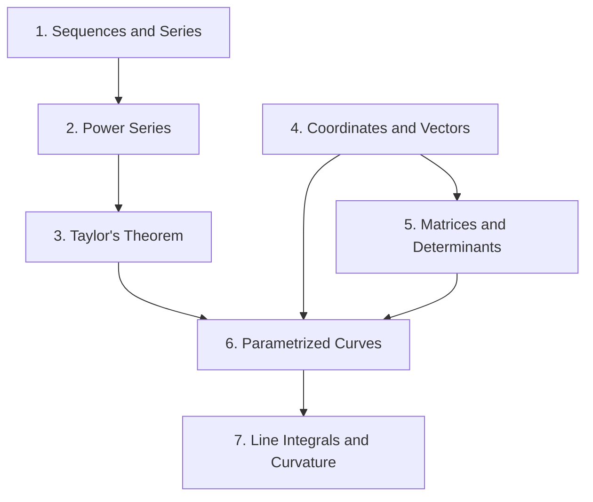

## Course information

| Item | Detail |
|---|---|
| Course | Mathematics 1 (수학 1), L0442.000100 |
| Institution | Seoul National University |
| Semester | Spring 2022 |
| Instructor | Choi Hyung Gyu (최형규) |
| Textbook | Hong Jong Kim, *Calculus 1+* (미적분학 1+), 2nd revised edition, SNU Press |

The course covered Chapters 1 through 9 of the textbook. Chapter appendices were excluded from the examinable scope, with one exception: §7.4.2, on properties of the determinant. Chapter 8 was limited to §8.1, the cross product. These notes follow that scope.

## What this course is about

Despite the name, this is not a course about differentiating and integrating functions of one variable — that is assumed. It is a course about three things that turn out to be one thing. The first is **infinite processes**: what it means to add infinitely many numbers, and the discovery that the familiar functions $$e^x$$, $$\sin x$$, and $$\cos x$$ are most honestly *defined* as infinite sums rather than borrowed from geometry. The second is **approximation**: Taylor's theorem, which says that a smooth function near a point is a polynomial plus a controlled error, and which converts analysis into algebra whenever the error is small enough to ignore. The third is **the geometry of space**: vectors, matrices, determinants, and the curves traced out by a point moving through $$\mathbb{R}^3$$.

The unity comes at the end. A parametrized curve is a function $$\mathbb{R} \to \mathbb{R}^3$$; differentiating it gives velocity, differentiating again gives acceleration, and the length of such a curve is an integral. Everything from the first half — convergence, approximation, linear structure — is the machinery that makes those statements precise. The course is, in effect, single-variable calculus rebuilt on firmer ground and then pointed at space, as preparation for multivariable calculus in the sequel.

A disposition the course insisted on, and worth repeating here: for series we ask only **whether** a sum converges, almost never **what** it converges to. Values are rarely computable. This is not a limitation of the method; it is what analysis is like.

## Map of the units

**[Unit 1 — Sequences, Series, and Convergence Tests](/posts/calculus-1-series/)**
Textbook Chapter 1. The $$\varepsilon$$–$$N$$ definition of a limit, completeness of $$\mathbb{R}$$, and the full battery of convergence tests: comparison, root, ratio, integral, alternating. Absolute versus conditional convergence, and why the order of summation can matter.

**[Unit 2 — Power Series and the Elementary Functions](/posts/calculus-1-power-series/)**
Textbook Chapter 2. Radius of convergence and term-by-term differentiation. The exponential, trigonometric, and hyperbolic functions defined by their series, plus the inverse function theorem and the series for the inverse trigonometric functions.

**[Unit 3 — Mean Value Theorems, L'Hôpital's Rule, and Taylor's Theorem](/posts/calculus-1-taylor/)**
Textbook Chapter 3. Cauchy's mean value theorem as the engine behind both L'Hôpital's rule and the Taylor remainder. Infinitesimals, approximating polynomials, and expansion about an arbitrary point.

**[Unit 4 — Coordinates and Vectors in Space](/posts/calculus-1-coordinates-vectors/)**
Textbook Chapters 4 and 5. Coordinate space, together with the polar, cylindrical, and spherical coordinate systems. Directed segments and vectors, the inner product, equations of lines and planes, centroids, and linear independence.

**[Unit 5 — Matrices, Linear Maps, and Determinants](/posts/calculus-1-determinants/)**
Textbook Chapters 6 and 7, plus §8.1. Matrices as linear maps, inverses, permutations, and the determinant with its properties. Ends with the cross product, which is built from a determinant.

**[Unit 6 — Parametrized Curves and Arc Length](/posts/calculus-1-curves/)**
Textbook §§9.1–9.6. Velocity and acceleration, plane curves in polar form, reparametrization, the length of a curve, and parametrization by arc length.

**[Unit 7 — Line Integrals and Curvature](/posts/calculus-1-line-integrals-curvature/)**
Textbook §§9.7–9.8. Integration along a curve, and curvature as the measure of how sharply a curve bends.

## Notation conventions

Used consistently across all units of this course.

| Symbol | Meaning |
|---|---|
| $$\mathbb{N}, \mathbb{Z}, \mathbb{Q}, \mathbb{R}, \mathbb{C}$$ | naturals, integers, rationals, reals, complex numbers |
| $$(a_n)$$ or $$a_n$$ | a sequence, always infinite, real-valued unless stated |
| $$S_n$$ | the $$n$$-th partial sum $$\sum_{k=1}^{n} a_k$$ |
| $$\sum a_n < \infty$$ | the series converges — **only** for nonnegative terms |
| $$\ln x$$ | natural logarithm; the textbook writes $$\log$$ for the same thing |
| $$\varepsilon, \delta$$ | arbitrary positive tolerances |
| $$\mathbf{v}, \mathbf{w}$$ | vectors (boldface); $$\lVert \mathbf{v} \rVert$$ is the norm |
| $$\mathbf{v}\cdot\mathbf{w}$$, $$\mathbf{v}\times\mathbf{w}$$ | inner product, cross product |
| $$\det A$$ or $$\lvert A \rvert$$ | determinant of a square matrix $$A$$ |
| $$\boldsymbol{\gamma}(t)$$ | a parametrized curve; $$s$$ denotes arc length |

Two conventions inherited from the textbook are worth flagging, because they differ from what you may see elsewhere. First, $$\log$$ always means the natural logarithm — never base 10, never base 2. I write $$\ln$$ throughout these notes to remove the ambiguity. Second, "sequence" (수열) means an infinite sequence by definition; finite lists are never called sequences.

<!-- TODO: verify the textbook's own notation for vectors (boldface vs. arrow accent) and for the norm, and reconcile if it differs from the boldface used here. -->

## Key takeaways

**Completeness is the foundation of everything.** Every convergence theorem in the first half of the course reduces to a single fact: an increasing sequence bounded above converges. That fact is the least upper bound axiom in disguise, and it is the one property that separates $$\mathbb{R}$$ from $$\mathbb{Q}$$. Density is not enough; $$\mathbb{Q}$$ is dense and still full of holes.

**Convergence before value.** Deciding that a series converges and computing its sum are different problems of wildly different difficulty. The course teaches the first and largely abandons the second. Learn to recognize which question you are being asked.

**The elementary functions are series.** Defining $$e^x$$ by $$\sum x^n/n!$$ rather than by exponent rules, and $$\sin x$$ by its series rather than by a triangle, is not pedantry. It is what makes the derivatives, the identities, and the extension to complex arguments all fall out of one computation each.

**Approximation is a theorem, not a fudge.** Taylor's theorem does not merely assert that a function resembles a polynomial; it bounds the discrepancy. The bound is what licenses every later use of a linearization.

**Inequalities are a skill.** Nearly every proof in the first half turns on choosing a good inequality and discarding the right terms. This is harder than it looks and improves only with practice.

**Linear algebra is geometry.** A matrix is a linear map; a determinant is a signed volume; a cross product is a determinant. Treating these as computational recipes works for exams and fails for understanding.

## Further resources

**Textbooks.** Stewart's *Calculus* and Thomas' *Calculus* are the standard companions for the computational side and have far more exercises than the course textbook. For the analysis that this course deliberately keeps informal — the $$\varepsilon$$–$$\delta$$ definition of a function limit, rigorous treatment of rearrangements, completeness in full — Spivak's *Calculus* is the gentlest serious option, Apostol's *Calculus* Vol. I the most systematic, and Rudin's *Principles of Mathematical Analysis* the destination. For the linear algebra half, Strang's *Introduction to Linear Algebra* complements Chapters 6 and 7 well, and Friedberg, Insel and Spence is the more abstract alternative.

**Video.** The lectures explicitly recommended 3Blue1Brown and Numberphile on YouTube. 3Blue1Brown's *Essence of Linear Algebra* and *Essence of Calculus* series are unusually good at the geometric intuition that slides compress away. MIT OpenCourseWare 18.01 and 18.02 cover roughly this material in English.

**Past exams.** The SNU liberal-arts mathematics TA office maintains an archive of past 수학 1 examinations at [taoffice.math.snu.ac.kr](https://taoffice.math.snu.ac.kr/board/index.php?mid=board_L01). These are the best calibration for what the course actually expects.

A word of caution the course itself offered about video resources: their strength is that any one explanation can be excellent, and their weakness is that the explanations do not connect. A lecture course maintains a planned thread across a semester. Use the videos to unstick yourself, not to replace the thread.
