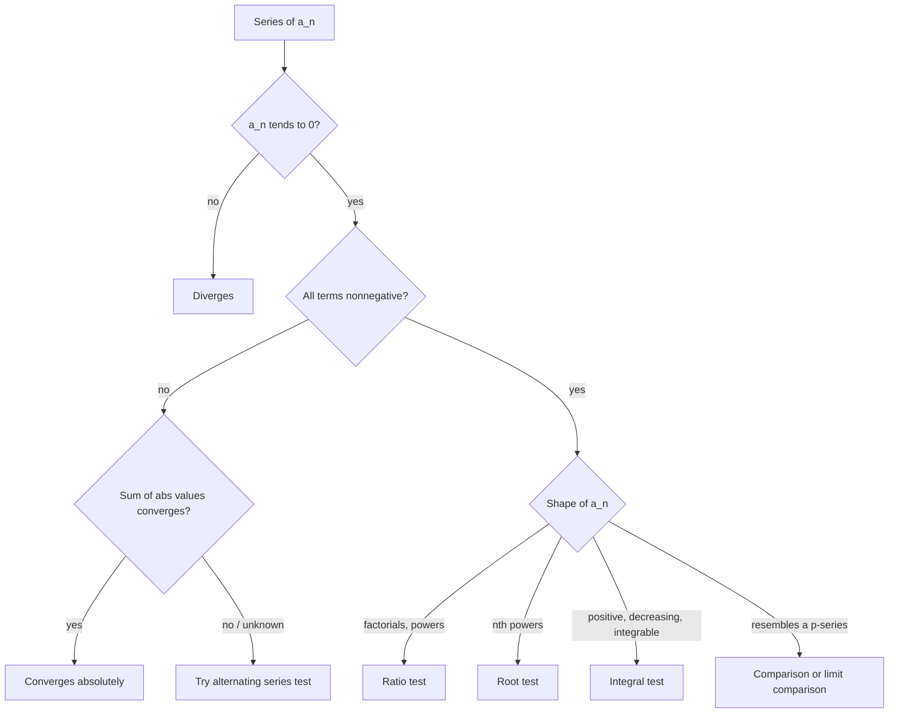

## What this unit answers

Given an infinite list of numbers, what does it mean to add them all up, and when does that sum exist? This is the first unit of the course, and it sets the tone for everything after it: the point is not to compute sums but to decide whether they exist. As the lecture put it, we learn to judge convergence *when we are lucky*. There is no algorithm that settles every series.

The unit matters beyond its own content because the next unit, [Power Series and the Elementary Functions](/posts/calculus-1-power-series/), *defines* $$e^x$$, $$\sin x$$, and $$\cos x$$ as infinite sums. Those definitions are worthless unless we can certify that the sums converge, and the certificates come from here.

## Prerequisites

High-school familiarity with limits and with the sigma notation $$\sum$$. Nothing else is assumed: the $$\varepsilon$$–$$N$$ definition of a limit, which is the technical heart of this unit, is introduced from scratch below. Basic integration is needed for the integral test in the section on [the integral test](#the-integral-test-and-the-p-series).

## What the real numbers are, and why we care

Before any analysis happens, the course spends a page saying what $$\mathbb{R}$$ actually is. Four properties, in increasing order of depth.

**It is a field.** The four arithmetic operations never take you outside $$\mathbb{R}$$ (division by zero excepted). The integers $$\mathbb{Z}$$ fail this, since $$1/2 \notin \mathbb{Z}$$; the rationals $$\mathbb{Q}$$, the reals $$\mathbb{R}$$, and the complex numbers $$\mathbb{C}$$ all pass. So does $$\mathbb{Q}(\sqrt{2}) = \{a + b\sqrt{2} : a, b \in \mathbb{Q}\}$$, and so does $$\mathbb{Z}_p$$ — the integers modulo $$p$$ — but only when $$p$$ is prime. Modulo $$4$$ the element $$2$$ has no inverse, because $$2 \cdot x \equiv 1 \pmod 4$$ has no solution, so $$\mathbb{Z}_4$$ is not a field.

**It is totally ordered.** Any two reals are comparable. Vectors in the plane are not, which is why "$$\mathbb{R}^2$$ with its usual structure" is not an ordered field.

**It is dense.** Between any two distinct reals lies another real. Note that $$\mathbb{Q}$$ is also dense, so density alone is not what separates the two.

**It is complete.** This is the one that does the work. Completeness is the *least upper bound axiom*: every nonempty set of reals that is bounded above has a least upper bound (a supremum) in $$\mathbb{R}$$. Equivalently — and this is the form we will use constantly — **every increasing sequence that is bounded above converges.**

To see that $$\mathbb{Q}$$ is dense but *not* complete, take $$S = \{q \in \mathbb{Q} : q < \sqrt{2}\}$$. Inside $$\mathbb{Q}$$ this set is bounded above, but it has no least rational upper bound: whatever rational bound you name, there is a smaller one, because the only candidate for the least bound is $$\sqrt{2}$$, which is irrational. Density does not patch the holes; completeness is what fills them.

> The supremum of a set need not belong to the set. For $$S = \{q \in \mathbb{Q}: q < \sqrt 2\}$$ the supremum is $$\sqrt 2$$, which is not in $$S$$, so $$S$$ has a supremum but no maximum. A maximum is a supremum that happens to be attained.
{: .prompt-tip }

Finally, $$\mathbb{R}$$ is uncountable. Two sets have the same cardinality when a bijection between them exists; there is an injection $$\mathbb{N} \to \mathbb{R}$$ but none from $$\mathbb{R}$$ into $$\mathbb{N}$$. This is Cantor's theorem. It plays no computational role in this course, but it explains why "list all the reals and check them one by one" is never a proof strategy.

## Sequences and their limits

A **sequence** is a function with domain $$\mathbb{N}$$, written $$a_1, a_2, a_3, \ldots$$. In this course "sequence" always means *infinite* sequence, and unless stated otherwise the terms are real numbers.

### The $$\varepsilon$$–$$N$$ definition

Everyone arrives knowing that $$\lim_{n\to\infty} n \sin(1/n) = 1$$ and can say why: as $$n$$ grows, $$n\sin(1/n)$$ gets "arbitrarily close" to $$1$$. The numbers back this up — the gap is about $$1.7 \times 10^{-3}$$ at $$n = 10$$ and about $$1.7 \times 10^{-8}$$ at $$n = 1000$$. But "arbitrarily close" is an invitation to argue. The definition that closes the argument is:

$$
\begin{aligned}
\lim_{n\to\infty} a_n = b
\quad \Longleftrightarrow \quad
&\forall \varepsilon > 0,\ \exists N \ \text{ s.t. } \\
&\lvert a_n - b\rvert < \varepsilon \ \text{ whenever } n \ge N.
\end{aligned}
$$

Read it as a two-player game. Your opponent picks a tolerance $$\varepsilon$$, as small as they like. You must produce a cutoff index $$N$$ past which the sequence stays within $$\varepsilon$$ of $$b$$. If you can always answer, the limit is $$b$$.

Four phrasings of the same statement, all used interchangeably in lecture:

- For every $$\varepsilon > 0$$, all but finitely many terms satisfy $$\lvert a_n - b\rvert < \varepsilon$$.
- All but finitely many $$a_n$$ lie in any given neighborhood of $$b$$.
- For every $$\varepsilon > 0$$ and all sufficiently large $$n$$, $$\lvert a_n - b \rvert < \varepsilon$$.
- For all sufficiently large $$n$$, $$a_n$$ lies in any given neighborhood of $$b$$.

"All but finitely many" and "all sufficiently large $$n$$" mean the same thing. Both are shorthand for "there is an $$N$$ beyond which", and both make the point that **no finite collection of terms can affect a limit.**

### Worked example: a limit from the definition

Show $$\lim_{n\to\infty} \dfrac{3n+1}{n+2} = 3$$.

Compute the gap first:

$$
\left\lvert \frac{3n+1}{n+2} - 3 \right\rvert
= \left\lvert \frac{3n + 1 - 3n - 6}{n+2} \right\rvert
= \frac{5}{n+2} < \frac{5}{n}.
$$

Given $$\varepsilon > 0$$, choose $$N > 5/\varepsilon$$. Then for $$n \ge N$$ the gap is below $$5/N < \varepsilon$$. The structural move — bound the gap by something obviously small, then read off $$N$$ — is the whole technique.

### Limit laws

Proofs are omitted in lecture; all follow from the definition by routine $$\varepsilon$$-chasing.

- Shifting the index changes nothing: $$\lim a_{n+k} = \lim a_n$$.
- Among $$a_n$$, $$b_n$$, $$a_n + b_n$$, if two converge then so does the third, and $$\lim(a_n+b_n) = \lim a_n + \lim b_n$$.
- Among $$a_n$$, $$b_n$$, $$a_nb_n$$ (or $$a_n/b_n$$), if two converge then so does the third, with $$\lim(a_nb_n) = \lim a_n \lim b_n$$ and $$\lim (a_n/b_n) = \lim a_n / \lim b_n$$ provided $$\lim b_n \ne 0$$.
- Scalars pull out: $$\lim(ta_n) = t \lim a_n$$.
- Order is preserved weakly: if $$a_n \le b_n$$ for all $$n$$ and both limits exist, then $$\lim a_n \le \lim b_n$$. Strict inequality is *not* preserved: $$1/n > 0$$ for every $$n$$, yet the limit is $$0$$.
- **Squeeze theorem.** If $$a_n \le b_n \le c_n$$ and $$\lim a_n = \lim c_n = \ell$$, then $$\lim b_n = \ell$$.

### Growth rates worth memorizing

Four limits recur so often that they function as reference points.

**Conjugate trick.** $$\displaystyle\lim_{n\to\infty}\left(\sqrt{n^2+n} - n\right) = \tfrac12$$. The expression is an $$\infty - \infty$$ indeterminate form; multiplying by the conjugate converts it:

$$
\sqrt{n^2+n}-n = \frac{n}{\sqrt{n^2+n}+n} = \frac{1}{\sqrt{1 + 1/n} + 1} \longrightarrow \frac12 .
$$

**Exponentials beat polynomials.** For any $$\varepsilon > 0$$ and any fixed $$k$$,

$$
\lim_{n\to\infty} \frac{(1+\varepsilon)^n}{n^k} = \infty .
$$

The proof is a single well-chosen inequality. By the binomial theorem, all of whose terms are positive,

$$
(1+\varepsilon)^n > \binom{n}{k+1}\varepsilon^{k+1},
$$

and the right side is a polynomial in $$n$$ of degree $$k+1$$, which outgrows $$n^k$$. This is the first appearance of a theme the lecture stressed: *using an inequality well is not an elementary skill.* Discarding the right terms is the entire argument.

**Logarithms lose to everything.** $$\displaystyle\lim_{n\to\infty}\frac{\ln n}{n} = 0$$. Substituting $$t = \ln n$$, so $$n = e^t$$ and $$t \to \infty$$, turns this into $$\lim_{t\to\infty} t/e^t = 0$$, which is the previous fact.

**The number $$e$$.**

$$
e := \lim_{n\to\infty}\left(1 + \frac1n\right)^n = \lim_{t\to 0}(1+t)^{1/t} \approx 2.7182818 .
$$

A consequence worth having ready: $$\lim_{n\to\infty}(1 - 1/n)^n = 1/e$$, obtained by substituting $$t = -1/n$$ so that the expression becomes $$(1+t)^{-1/t}$$. We will see in the next unit that $$e = \sum_{n\ge 0} 1/n!$$, which is the formula you actually use to compute it.

> Throughout this course $$\log$$ means the natural logarithm. The lecture writes $$\ln$$ for emphasis and permits either on exams. On this site I write $$\ln$$ consistently.
{: .prompt-info }

Two notes of honesty about the last two examples. First, they silently replace a limit of a *sequence* by a limit of a *function* — the $$\varepsilon$$–$$\delta$$ definition of a function limit has not been given, and the course deliberately leaves it informal at this stage. Second, doing everything rigorously costs time; some looseness while learning is deliberate, provided you know which parts are loose.

## From sequences to series

A **series** is the limit of the sequence of partial sums:

$$
\begin{aligned}
\sum_{n=1}^{\infty} a_n &:= \lim_{n\to\infty} S_n, \\
S_n &= \sum_{k=1}^{n} a_k .
\end{aligned}
$$

Every statement about series is therefore a statement about the sequence $$(S_n)$$ in disguise. The basic properties transfer directly:

$$
\begin{aligned}
\sum_{n=1}^{\infty}(a_n+b_n) &= \sum_{n=1}^{\infty}a_n + \sum_{n=1}^{\infty}b_n, \\
\sum_{n=1}^{\infty}(ta_n) &= t\sum_{n=1}^{\infty}a_n ,
\end{aligned}
$$

the first on the understanding that if two of the three series converge, so does the third.

**Tail independence.** $$\sum_{n=1}^{\infty} a_n$$ converges if and only if $$\sum_{n=N}^{\infty} a_n$$ converges, for any $$N$$. Chopping off finitely many terms changes the *value* of a convergent series but never the *fact* of convergence. Every test below exploits this: hypotheses only ever need to hold eventually.

### Geometric series

The one family whose sum we can always write down:

$$
\sum_{n=0}^{\infty} r^n = 1 + r + r^2 + \cdots =
\begin{cases}
\dfrac{1}{1-r}, & \lvert r \rvert < 1,\\[2ex]
\text{divergent}, & \text{otherwise.}
\end{cases}
$$

Geometric series are the yardstick against which the root and ratio tests measure everything else, and they are the engine behind compound-interest computations: the accumulated value of a fixed deposit made every period, and the amortization schedule of a loan, are both finite geometric sums.

### Worked example: a repeating decimal

Write $$0.4\overline{27} = 0.4272727\ldots$$ as a fraction. Split off the non-repeating head and treat the tail as geometric with ratio $$r = 10^{-2}$$:

$$
\begin{aligned}
0.4\overline{27}
&= \frac{4}{10} + \frac{27}{10^3}\sum_{n=0}^{\infty} 10^{-2n} \\
&= \frac{4}{10} + \frac{27}{1000}\cdot\frac{1}{1 - 1/100} \\
&= \frac{2}{5} + \frac{27}{990} = \frac{47}{110}.
\end{aligned}
$$

### The harmonic series diverges

$$
\sum_{n=1}^{\infty}\frac1n = 1 + \frac12 + \frac13 + \cdots = \infty .
$$

Group the terms in blocks whose lengths double. Each block sums to at least $$1/2$$, because its smallest term is at least half of the block's length reciprocal:

$$
\begin{aligned}
\sum_{n=1}^{\infty}\frac1n
&= 1 + \frac12 + \left(\frac13+\frac14\right) \\
&\qquad + \left(\frac15+\cdots+\frac18\right) + \left(\frac19+\cdots+\frac{1}{16}\right)+\cdots\\
&\ge 1 + \frac12 + \frac12 + \frac12 + \frac12 + \cdots = \infty .
\end{aligned}
$$

This is the classic illustration of how slowly a divergent series can diverge. A sharper statement, obtained by comparing the sum with an integral, is

$$
\frac12 + \frac13 + \cdots + \frac1N < \ln N < 1 + \frac12 + \cdots + \frac{1}{N-1},
$$

so the partial sums grow like $$\ln N$$. The physical version the lecture mentioned: coins stacked on a table edge, each offset by a harmonic fraction of its length, can in principle overhang any distance — but the number of coins required to span a river is so astronomical that the mass exceeds that of the observable universe. Divergence and feasibility are different questions.

### The $$n$$-th term test

**Theorem.** If $$\sum_{n=k}^{\infty} a_n$$ converges, then $$\lim_{n\to\infty} a_n = 0$$.

*Proof.* $$a_n = S_n - S_{n-1}$$, and both partial-sum sequences converge to the same limit, so the difference tends to $$0$$. $$\square$$

The useful form is the contrapositive: **if $$a_n \not\to 0$$, the series diverges.** This is the cheapest test available and should always be tried first. Thus $$1 - 1 + 1 - 1 + \cdots$$ diverges, because its terms do not tend to $$0$$; its partial sums oscillate between $$1$$ and $$0$$ forever.

The converse is false, and the harmonic series is the standing counterexample: $$1/n \to 0$$ yet the series diverges.

## Tests for nonnegative series

A series is **nonnegative** (양항급수) when $$a_n \ge 0$$ for all $$n$$. Its partial sums are increasing, so by completeness exactly two things can happen: they are bounded and the series converges, or they are unbounded and $$S_n \to \infty$$. That dichotomy is what makes the following notation safe:

$$
\begin{aligned}
\sum_{n=k}^{\infty} a_n < \infty &\ \text{ means convergent}, \\
\sum_{n=k}^{\infty} a_n = \infty &\ \text{ means divergent}.
\end{aligned}
$$

> This notation is **only** legitimate for nonnegative series. The alternating series $$1 - \frac12 + \frac13 - \frac14 + \cdots$$ converges, but writing "$$\cdots < \infty$$" for it is meaningless: for a general series, "$$\lim S_n < \infty$$" is not equivalent to "$$S_n$$ converges", since $$S_n$$ might oscillate without having any limit at all. Say "the series converges" instead.
{: .prompt-warning }

### Comparison test

**Theorem.** Suppose $$0 \le a_n \le b_n$$ for all $$n \ge k$$. Then

$$
\begin{aligned}
\sum_{n=k}^{\infty} b_n < \infty &\ \Longrightarrow\ \sum_{n=k}^{\infty} a_n < \infty, \\
\sum_{n=k}^{\infty} a_n = \infty &\ \Longrightarrow\ \sum_{n=k}^{\infty} b_n = \infty .
\end{aligned}
$$

*Proof.* The two lines are contrapositives of each other, so one proof suffices. If $$\sum b_n = \ell < \infty$$ then every partial sum of $$\sum a_n$$ satisfies $$\sum_{n=k}^{m} a_n \le \sum_{n=k}^{m} b_n \le \ell$$. An increasing sequence bounded above converges. $$\square$$

A short digression the lecture made here, because it causes trouble: the **contrapositive** of "$$P \Rightarrow Q$$" is "$$\text{not }Q \Rightarrow \text{not }P$$", and it is *logically identical* to the original. "If a triangle is right-angled then $$c^2 = a^2+b^2$$" and "if $$c^2 \ne a^2+b^2$$ then the triangle is not right-angled" are the same statement. Note that a *false* statement and its contrapositive are also identical — both false. Contraposition preserves truth value, it does not confer it.

### Worked example: comparison in both directions

Decide the fate of $$\displaystyle\sum_{n=1}^{\infty}\frac{n+\ln n}{n^3+1}$$.

For $$n \ge 1$$ we have $$\ln n \le n$$, so the numerator is at most $$2n$$, while $$n^3 + 1 > n^3$$. Hence

$$
0 \le \frac{n+\ln n}{n^3+1} \le \frac{2n}{n^3} = \frac{2}{n^2},
$$

and since $$\sum 1/n^2 < \infty$$ (proved below), the series converges.

Compare with $$\displaystyle\sum_{n=1}^{\infty}\frac{1}{\sqrt n}$$. Here $$1/\sqrt n \ge 1/n$$ and $$\sum 1/n = \infty$$, so the series diverges.

> Comparing in the useless direction proves nothing. For $$\sum 1/n^{3/2}$$ the bound $$1/n^{3/2} < 1/n$$ is true and worthless, since $$\sum 1/n$$ diverges — being smaller than something infinite says nothing. You need a *convergent* upper bound or a *divergent* lower bound.
{: .prompt-warning }

The test also tolerates finitely many negative terms, by tail independence. For instance $$\sum \frac{1}{n^2 - e^{2022}n}$$ has negative terms at the start but is eventually nonnegative, which is all the test needs.

### Limit comparison test

Direct comparison requires an inequality, and inequalities can be awkward to produce. The limit version removes that burden.

**Theorem.** Let $$a_n, b_n > 0$$ and suppose $$\displaystyle\lim_{n\to\infty}\frac{b_n}{a_n} = c$$ with $$0 < c < \infty$$. Then $$\sum a_n$$ and $$\sum b_n$$ converge or diverge together.

*Proof.* Take $$\varepsilon = c/2 > 0$$. For all sufficiently large $$n$$, $$\lvert b_n/a_n - c\rvert < \varepsilon$$, that is

$$
\frac{c}{2}\,a_n < b_n < \frac{3c}{2}\,a_n .
$$

If $$\sum a_n$$ converges, the right inequality and the comparison test give convergence of $$\sum b_n$$; if $$\sum a_n$$ diverges, the left inequality gives divergence of $$\sum b_n$$. The reverse implications follow by symmetry. $$\square$$

### Worked example: a trigonometric series

Does $$\displaystyle\sum_{n=1}^{\infty}\sin\frac{1}{n}$$ converge?

The terms are positive for $$n \ge 1$$, and $$\sin(1/n) \to 0$$, so the $$n$$-th term test is silent. Compare with $$a_n = 1/n$$, using the standard limit $$\lim_{t\to 0}\frac{\sin t}{t} = 1$$:

$$
\lim_{n\to\infty}\frac{\sin(1/n)}{1/n} = \lim_{t \to 0^+}\frac{\sin t}{t} = 1 \in (0,\infty).
$$

Since $$\sum 1/n = \infty$$, the series **diverges**. The same comparison with $$1/n^2$$ shows $$\sum \sin(1/n^2)$$ converges. Note also that $$\tan t > t > \sin t$$ for small $$t > 0$$, so $$\sum \tan(1/n)$$ diverges by direct comparison from below with the harmonic series, while $$\sum \tan(1/n^2)$$ converges by limit comparison with $$\sum 1/n^2$$.

### Root test

Terminology first, since the Korean name 거듭제곱근 and the English *root* can both confuse: $$2^n$$ is the $$n$$-th power of $$2$$, and $$\sqrt[n]{2} = 2^{1/n}$$ is the $$n$$-th root of $$2$$.

**Theorem.** Let $$a_n \ge 0$$ and suppose $$r := \lim_{n\to\infty}\sqrt[n]{a_n}$$ exists. Then

- $$r < 1 \Rightarrow \sum a_n$$ converges;
- $$r > 1 \Rightarrow \sum a_n$$ diverges;
- $$r = 1 \Rightarrow$$ no conclusion.

*Proof.* Suppose $$r < 1$$. Pick $$\varepsilon > 0$$ small enough that $$0 < r + \varepsilon < 1$$. For all sufficiently large $$n$$ we get $$0 \le \sqrt[n]{a_n} < r + \varepsilon$$, hence $$0 \le a_n < (r+\varepsilon)^n$$. The right side is a convergent geometric series, so comparison finishes it.

Suppose $$r > 1$$. Pick $$\varepsilon$$ with $$r - \varepsilon > 1$$. Eventually $$\sqrt[n]{a_n} > r - \varepsilon > 1$$, so $$a_n > (r-\varepsilon)^n \to \infty$$; the terms do not tend to $$0$$ and the $$n$$-th term test gives divergence. $$\square$$

The test is really the statement "if the series is eventually dominated by a geometric series of ratio less than $$1$$, it converges".

### Worked example: root test

$$\displaystyle\sum_{n=2}^{\infty}\frac{1}{(\ln n)^n}$$. Here $$\sqrt[n]{a_n} = 1/\ln n \to 0 < 1$$, so the series converges.

$$\displaystyle\sum_{n=1}^{\infty}\left(1 - \frac1n\right)^{n^2}$$. Here $$\sqrt[n]{a_n} = (1-1/n)^n \to 1/e < 1$$, so the series converges. Notice how the exponent $$n^2$$ is exactly what makes the root test natural: taking an $$n$$-th root leaves a clean $$n$$-th power.

For $$r = 1$$, both $$\sum 1/n$$ and $$\sum 1/n^2$$ give $$\sqrt[n]{a_n}\to 1$$, yet one diverges and one converges. That is the whole content of the inconclusive case.

### Ratio test

**Theorem.** Let $$a_n > 0$$ and suppose $$\rho := \lim_{n\to\infty}\dfrac{a_{n+1}}{a_n}$$ exists. Then $$\rho < 1$$ implies convergence, $$\rho > 1$$ implies divergence, and $$\rho = 1$$ is inconclusive.

*Proof.* Suppose $$\rho < 1$$ and fix $$\varepsilon$$ with $$0 < \rho+\varepsilon < 1$$. For $$n \ge N$$, $$a_{n+1} < (\rho+\varepsilon)a_n$$. Iterating from $$N$$,

$$
a_{N+k} < (\rho+\varepsilon)^k a_N ,
$$

so the tail $$\sum_{k\ge 0} a_{N+k}$$ is dominated by a geometric series of ratio less than $$1$$. By tail independence the whole series converges. The case $$\rho > 1$$ is symmetric: the terms eventually increase and cannot tend to $$0$$. $$\square$$

### Worked example: ratio test and factorials

$$\displaystyle\sum_{n=1}^{\infty}\frac{n}{3^n}$$. The ratio is $$\frac{n+1}{n}\cdot\frac{1}{3} \to \frac13 < 1$$: convergent.

$$\displaystyle\sum_{n=1}^{\infty}\frac{n^n}{n!}$$. The ratio is

$$
\begin{aligned}
\frac{(n+1)^{n+1}}{(n+1)!}\cdot\frac{n!}{n^n}
&= \left(\frac{n+1}{n}\right)^{n} \\
&= \left(1+\frac1n\right)^n \to e > 1,
\end{aligned}
$$

so the series diverges. (Equivalently, its terms blow up.)

For which $$x>0$$ does $$\sum x^n/n!$$ converge? The ratio is $$\frac{x^{n+1}}{(n+1)!}\cdot\frac{n!}{x^n} = \frac{x}{n+1} \to 0 < 1$$ for *every* $$x$$. The series converges for all $$x$$ — which is exactly why $$e^x$$ can be defined by it in the next unit.

Rule of thumb: factorials and fixed powers call for the ratio test; $$n$$-th powers call for the root test. The root test is in fact strictly stronger (it works whenever the ratio test does, and sometimes when the ratio oscillates), but the ratio test is usually easier to compute.

### The integral test and the $$p$$-series

First, an **improper integral** (특이적분) is one where either the interval is unbounded or the integrand blows up:

$$
\begin{aligned}
\int_a^{\infty} f(x)\,dx &= \lim_{N\to\infty}\int_a^{N}f(x)\,dx, \\
\int_a^{b} f(x)\,dx &= \lim_{\varepsilon\to 0^+}\int_{a+\varepsilon}^{b}f(x)\,dx .
\end{aligned}
$$

The integral converges when the limit exists. In practice one writes the antiderivative and evaluates at the endpoint formally, e.g. $$\int_1^\infty x^{-2}\,dx = [-1/x]_1^\infty = 1$$. But formality has limits: $$\int_1^\infty \sin x\,dx = [-\cos x]_1^\infty$$ has no value, because $$\cos N$$ oscillates, so that improper integral diverges.

**Theorem (integral test).** Let $$f : [1,\infty) \to \mathbb{R}$$ be decreasing with $$f(x) > 0$$. Then

$$
\sum_{n=1}^{\infty} f(n) < \infty
\quad \Longleftrightarrow \quad
\int_1^{\infty} f(x)\,dx < \infty .
$$

*Proof.* Because $$f$$ decreases, on each interval $$[n, n+1]$$ it is squeezed between its endpoint values. Summing the resulting rectangle estimates,

$$
f(2) + \cdots + f(n+1) \le \int_1^{n+1} f(x)\,dx \le f(1) + \cdots + f(n).
$$

The right inequality bounds the integral by the series; the left bounds the series tail by the integral. Either one being finite forces the other. $$\square$$

Both hypotheses matter. Positivity is what makes the partial sums increasing; monotonicity is what makes the rectangles sandwich the integral.

**Application: the $$p$$-series.** Take $$f(x) = x^{-s}$$ with $$s > 0$$, which is positive and decreasing on $$[1,\infty)$$. Then

$$
\int_1^{\infty}\frac{dx}{x^{s}} =
\begin{cases}
\left[\ln x\right]_1^{\infty} = \infty, & s = 1,\\[1ex]
\left[\dfrac{x^{1-s}}{1-s}\right]_1^{\infty}, & s \ne 1,
\end{cases}
$$

and the bracket is infinite for $$s<1$$, finite for $$s>1$$. Therefore

$$
\sum_{n=1}^{\infty}\frac{1}{n^{s}}
\begin{cases}
< \infty, & s > 1,\\
= \infty, & 0 < s \le 1 .
\end{cases}
$$

This single family is the comparison yardstick for most series you will meet. The borderline case $$s=1$$ is the harmonic series, recovered a third time.

The function defined by this sum for $$s>1$$ is the **Riemann zeta function** $$\zeta(s) = \sum_{n\ge1} n^{-s}$$. It extends to complex $$s$$, and the question of where its zeros lie is the Riemann hypothesis, still open and carrying a one-million-dollar prize.

One more integral-test consequence, just past the $$p$$-series boundary:

$$
\begin{aligned}
\sum_{n=2}^{\infty}\frac{1}{n\ln n} &= \infty, \\
\text{since}\quad \int_2^{\infty}\frac{dx}{x\ln x} &= \big[\ln(\ln x)\big]_2^{\infty} = \infty .
\end{aligned}
$$

So $$1/(n\ln n)$$ is small enough that no $$p$$-series comparison resolves it, yet still too large to sum.

### Choosing a test

## Series with terms of both signs

Everything above needed nonnegativity. For general series we can say much less, and only when we are, as the lecture put it, *very* lucky.

### Alternating series

An **alternating series** has terms that switch sign, $$a_n a_{n+1} < 0$$.

**Theorem (alternating series test).** If $$a_na_{n+1} < 0$$ and $$\lvert a_n \rvert$$ is eventually decreasing with $$\lvert a_n\rvert \to 0$$, then $$\sum a_n$$ converges.

*Proof sketch.* The partial sums step forward and back by shrinking amounts: $$S_1 > S_3 > S_5 > \cdots$$ and $$S_2 < S_4 < S_6 < \cdots$$, with every odd partial sum above every even one. The two monotone bounded sequences converge, and since $$\lvert S_{n+1} - S_n\rvert = \lvert a_{n+1}\rvert \to 0$$ they converge to the same point. $$\square$$

The picture also yields a sharp error bound, because the true sum is always trapped between consecutive partial sums:

$$
\left\lvert \sum_{n=1}^{\infty}a_n - \sum_{n=1}^{N}a_n \right\rvert < \lvert a_{N+1}\rvert .
$$

**The truncation error is smaller than the first omitted term.** This is unusually good news — most convergence proofs give no error estimate at all.

### Worked example: error control

Approximate $$\sum_{n=1}^{\infty}\frac{(-1)^{n+1}}{n^3}$$ to within $$10^{-2}$$.

The terms alternate and $$1/n^3$$ decreases to $$0$$, so the test applies and the error after $$N$$ terms is below $$1/(N+1)^3$$. We need $$(N+1)^3 > 100$$, so $$N = 4$$ suffices:

$$
1 - \frac18 + \frac1{27} - \frac1{64} \approx 0.8966,
$$

and the true value is within $$1/125 = 0.008$$ of this.

### Absolute convergence

$$\sum a_n$$ **converges absolutely** when $$\sum \lvert a_n \rvert < \infty$$.

**Theorem.** Absolute convergence implies convergence.

*Proof.* Write $$a_n$$ as a difference of two nonnegative sequences:

$$
a_n = \tfrac12\big(a_n + \lvert a_n\rvert\big) - \tfrac12\big(\lvert a_n\rvert - a_n\big).
$$

Both brackets lie in $$[0, 2\lvert a_n\rvert]$$, so by comparison both $$\sum \tfrac12(a_n+\lvert a_n\rvert)$$ and $$\sum\tfrac12(\lvert a_n\rvert - a_n)$$ converge. Their difference is $$\sum a_n$$. $$\square$$

This is the workhorse for general series: **test $$\sum\lvert a_n\rvert$$ with the nonnegative machinery, and if it converges you are done.** If it diverges, you have learned nothing about $$\sum a_n$$ and must look elsewhere.

A series that converges but not absolutely is **conditionally convergent**. The standard pair:

- $$\sum (-1)^n/n$$ converges (alternating test) but not absolutely (harmonic). Conditionally convergent.
- $$\sum (-1)^n/n^2$$ converges absolutely, since $$\sum 1/n^2 < \infty$$.

### Why order matters

For a finite sum, rearranging the terms or inserting parentheses changes nothing. For an infinite series, both operations can change the answer.

Inserting parentheses into $$1 - 1 + 1 - 1 + \cdots$$ gives $$(1-1)+(1-1)+\cdots = 0$$ or $$1 - (1-1) - (1-1) - \cdots = 1$$; the unparenthesized series diverges.

Worse, **Riemann's rearrangement theorem**: a conditionally convergent series can be rearranged to converge to *any* prescribed real number, or to diverge. The recipe is simple once you see that its positive terms alone sum to $$+\infty$$ and its negative terms alone to $$-\infty$$. To reach a target $$L$$: add positive terms until you exceed $$L$$, then negative terms until you fall below, then positive again, and so on. Since the terms tend to $$0$$, the overshoots shrink and the rearranged series converges to $$L$$. To force divergence, overshoot by growing margins instead.

Absolutely convergent series are immune: any rearrangement of one converges to the same value. The proof belongs to a later analysis course, but the fact is worth carrying now.

## Common pitfalls

- **Using "$$<\infty$$" for a series with mixed signs.** The notation encodes the increasing-partial-sums dichotomy and is nonsense otherwise. For a general series, $$\lim S_n$$ may simply fail to exist.
- **Confusing supremum with maximum.** The supremum is the least upper bound; it need not be attained. Completeness guarantees the supremum exists, not that it belongs to the set.
- **Treating $$a_n \to 0$$ as sufficient.** It is necessary only. The harmonic series exists precisely to refuse this.
- **Comparing in the wrong direction.** Smaller than divergent, or larger than convergent, yields nothing.
- **Forgetting that the alternating test needs monotonicity.** Terms tending to $$0$$ with alternating signs is not enough on its own; the magnitudes must eventually decrease.
- **Reading $$r=1$$ or $$\rho=1$$ as divergence.** It means the test failed, not that the series does.
- **Applying the integral test to a non-monotone $$f$$.** The rectangle sandwich collapses without monotonicity.
- **Forgetting the root and ratio tests are stated for nonnegative terms.** For signed series, apply them to $$\lvert a_n\rvert$$ and conclude absolute convergence.

> The printed lecture notes write "$$r>1 \Rightarrow \sum b_n = \infty$$" in the root and ratio test statements, where $$\sum a_n = \infty$$ is intended. The versions above are corrected.
{: .prompt-info }

Also worth knowing, though beyond the course statement: the root and ratio tests are usually given with $$\limsup$$ in place of $$\lim$$, which removes the hypothesis that the limit exists. The $$\limsup$$ form of the root test is what makes the radius-of-convergence formula in the next unit work in full generality.

<!-- TODO: verify whether the course ever stated the limsup form of the root test, or only the lim form. The lecture notes use lim only. -->

## Connections

- **Forward, within the course.** [Power series](/posts/calculus-1-power-series/) are series whose terms contain a variable; the ratio and root tests, applied for each fixed $$x$$, produce the radius of convergence. The definitions of $$e^x$$, $$\sin x$$, $$\cos x$$, and the hyperbolic functions all rest on convergence results proved here. [Taylor's theorem](/posts/calculus-1-taylor/) answers the question these tests cannot: not *whether* a series converges, but *to what*.
- **Backward, to the real numbers.** Every convergence theorem in this unit traces back to one fact — an increasing sequence bounded above converges — which is completeness in disguise.
- **To other courses.** The Basel problem $$\sum 1/n^2 = \pi^2/6$$ is stated here and proved in later coursework via Fourier series; the zeta function is the gateway to analytic number theory. Improper integrals and their convergence reappear throughout Calculus 2.

A caution the lecture was explicit about: **we only ever ask whether a series converges, not what it converges to.** Cases where the value is computable — geometric series, telescoping sums, a handful of famous examples — are rare.

## Summary

| Test | Hypotheses | Conclusion |
|---|---|---|
| $$n$$-th term | none | $$a_n \not\to 0 \Rightarrow$$ diverges |
| Geometric | $$a_n = r^n$$ | converges iff $$\vert r\vert<1$$, to $$\frac{1}{1-r}$$ |
| Comparison | $$0\le a_n\le b_n$$ | $$\sum b_n<\infty \Rightarrow \sum a_n<\infty$$ |
| Limit comparison | $$a_n,b_n>0$$, $$b_n/a_n\to c\in(0,\infty)$$ | same behavior |
| Root | $$a_n\ge0$$, $$\sqrt[n]{a_n}\to r$$ | $$r<1$$ conv.; $$r>1$$ div.; $$r=1$$ silent |
| Ratio | $$a_n>0$$, $$a_{n+1}/a_n\to\rho$$ | $$\rho<1$$ conv.; $$\rho>1$$ div.; $$\rho=1$$ silent |
| Integral | $$f>0$$ decreasing | $$\sum f(n)<\infty \iff \int_1^\infty f<\infty$$ |
| Alternating | signs alternate, $$\vert a_n\vert \searrow 0$$ | converges; error $$<\vert a_{N+1}\vert$$ |
| Absolute | $$\sum\vert a_n\vert<\infty$$ | $$\sum a_n$$ converges |

Reference series to compare against:

| Series | Behavior |
|---|---|
| $$\sum r^n$$ | converges iff $$\vert r\vert<1$$ |
| $$\sum 1/n^{s}$$ | converges iff $$s>1$$ |
| $$\sum 1/n$$ | diverges (like $$\ln N$$) |
| $$\sum 1/(n\ln n)$$ | diverges |
| $$\sum 1/n!$$ | converges, to $$e-1$$ |

## References

- Hong Jong Kim, *Calculus 1+* (미적분학 1+), 2nd revised edition, Seoul National University Press — Chapter 1.
- Mathematics 1 (수학 1, L0442.000100), Seoul National University, Spring 2022. Instructor: Choi Hyung Gyu (최형규).
- Chapter 1 covers §1.1 through §1.7; the chapter appendix was outside the examinable scope.
