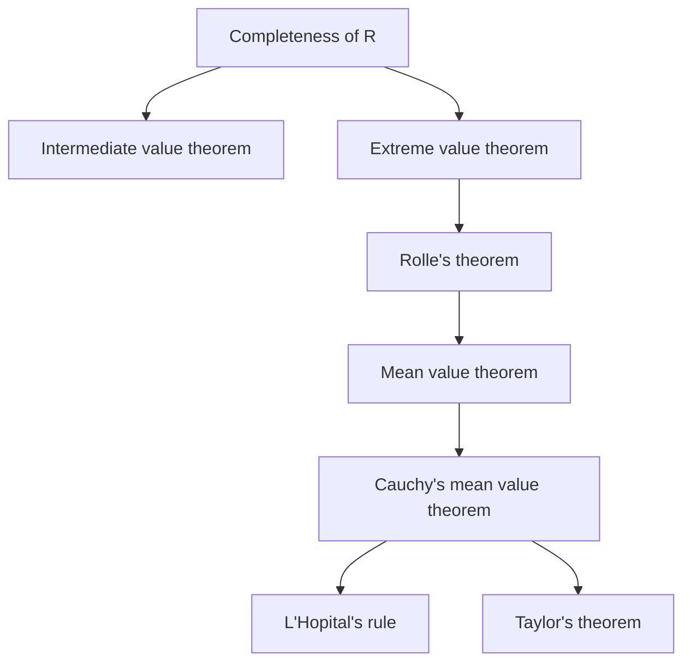

## What this unit answers

[Unit 2](/posts/calculus-1-power-series/) handled functions that *are* power series. But most functions are not handed to us that way. Given an arbitrary smooth function, can we still approximate it by a polynomial — and if so, how wrong is the answer?

Both questions are settled by Taylor's theorem, and Taylor's theorem rests on a single foundation: Cauchy's mean value theorem. The same foundation also yields L'Hôpital's rule. One theorem, two famous consequences.

The through-line of this unit is that **approximation is only useful when the error is bounded.** A polynomial that resembles $$f$$ is worth little; a polynomial together with a guarantee of how far it can stray is worth a great deal.

## Prerequisites

[Unit 1](/posts/calculus-1-series/) for completeness of $$\mathbb{R}$$ and the alternating-series error bound. [Unit 2](/posts/calculus-1-power-series/) for the coefficient formula $$a_n = f^{(n)}(0)/n!$$ and for what it means for a function to be analytic.

## The chain of mean value theorems

Everything in this unit descends from completeness through a chain of five theorems, each proved from the one before.

### Two theorems about continuous functions

**Intermediate value theorem.** If $$f$$ is continuous on $$[a,b]$$, then $$f$$ attains every value between $$f(a)$$ and $$f(b)$$.

**Extreme value theorem.** If $$f$$ is continuous on $$[a,b]$$, then $$f$$ attains a maximum and a minimum on $$[a,b]$$.

Both proofs are omitted in lecture, and both reduce to completeness — the fact that $$\mathbb{R}$$ has no gaps is precisely what forbids a continuous function from skipping a value or approaching a supremum it never reaches.

> These look obvious, and that is the danger. The intermediate value theorem is **false** over $$\mathbb{Q}$$: the function $$f(x) = x^2 - 2$$ is continuous and changes sign on $$[0,2]$$ but never equals zero at a rational point. Obviousness here is a property of $$\mathbb{R}$$, not of continuity.
{: .prompt-warning }

The lecture put the same point informally: tell someone a continuous function is one you can draw without lifting the pen, and they nod; tell them it is one whose graph joins any two of its points without a break, and they ask what you mean. The content is in the second phrasing.

### Rolle's theorem

**Theorem.** Let $$f$$ be continuous on $$[a,b]$$ and differentiable on $$(a,b)$$. If $$f(a) = f(b)$$, then $$f'(c) = 0$$ for some $$c$$ with $$a < c < b$$.

*Proof.* By the extreme value theorem, $$f$$ attains a minimum at some $$c$$ and a maximum at some $$d$$ in $$[a,b]$$.

If both $$c$$ and $$d$$ are endpoints, then since $$f(a)=f(b)$$ the maximum equals the minimum, so $$f$$ is constant and $$f' \equiv 0$$. Otherwise at least one of them is interior; call it $$c$$ and suppose it is a minimum with $$a<c<b$$. Approaching from each side,

$$
f'(c) = \lim_{h\to0^+}\frac{f(c+h)-f(c)}{h} \ge 0,
$$

$$
f'(c) = \lim_{h\to0^-}\frac{f(c+h)-f(c)}{h} \le 0 .
$$

The numerator is $$\ge 0$$ at a minimum, so the sign of the quotient is the sign of $$h$$. Both one-sided limits equal $$f'(c)$$, which is therefore both $$\ge 0$$ and $$\le 0$$. $$\square$$

### The mean value theorem

**Theorem.** Let $$f$$ be continuous on $$[a,b]$$ and differentiable on $$(a,b)$$. Then

$$
\frac{f(b)-f(a)}{b-a} = f'(c)
\qquad\text{for some } c \in (a,b).
$$

Geometrically: somewhere in the interval, the tangent is parallel to the secant.

*Proof.* Subtract the secant line from $$f$$:

$$
g(x) = f(x) - \left\{\frac{f(b)-f(a)}{b-a}(x-a) + f(a)\right\}.
$$

Then $$g(a) = g(b) = 0$$, so Rolle gives $$g'(c) = 0$$, which rearranges to the claim. $$\square$$

### Worked example: MVT as an inequality tool

Show that $$\lvert \sin u - \sin v\rvert \le \lvert u - v\rvert$$ for all real $$u,v$$.

Apply the mean value theorem to $$\sin$$ on the interval between $$u$$ and $$v$$:

$$
\sin u - \sin v = (\cos c)(u - v)
$$

for some $$c$$ between them. Since $$\lvert\cos c\rvert \le 1$$, taking absolute values gives the result.

This is the characteristic use of the MVT. You rarely care which $$c$$ it produces; you care that $$f(b)-f(a)$$ has been converted into a derivative times a length, and that the derivative can be bounded.

### Cauchy's mean value theorem

**Theorem.** Let $$f$$ and $$g$$ be continuous on $$[a,b]$$ and differentiable on $$(a,b)$$. Then

$$
\frac{f(b)-f(a)}{b-a} : \frac{g(b)-g(a)}{b-a} = f'(c) : g'(c)
$$

for some $$c \in (a,b)$$.

*Proof.* Apply Rolle to

$$
h(x) = \frac{g(b)-g(a)}{b-a}\,f(x) - \frac{f(b)-f(a)}{b-a}\,g(x),
$$

which satisfies $$h(a) = h(b)$$ after a short computation. $$\square$$

The ratio form is deliberate. Written as a fraction it requires $$g'(c)\ne0$$; as a ratio of pairs, the statement survives intact.

**What it means.** Think of $$\boldsymbol{\gamma}(t) = \big(f(t), g(t)\big)$$ as a point moving in the plane. Then $$\boldsymbol{\gamma}'(t) = (f'(t), g'(t))$$ is its velocity, and the theorem says: somewhere along the path, the velocity vector is parallel to the straight displacement from start to finish. The ordinary mean value theorem is the case $$g(t) = t$$.

**Does it extend to three functions?** No. The geometric picture explains why immediately: a curve in $$\mathbb{R}^3$$ can spiral so that its velocity is never parallel to the chord joining its endpoints. Two functions leave only one direction to miss; three leave a whole plane's worth. A helix running from one point to another is the standard counterexample.

### Worked example: Cauchy MVT directly

Evaluate $$\lim_{x\to0}\dfrac{e^x-1}{\sin x}$$ without L'Hôpital.

Both $$f(x)=e^x-1$$ and $$g(x)=\sin x$$ vanish at $$0$$, so Cauchy's theorem on $$[0,x]$$ gives, for some $$c$$ between $$0$$ and $$x$$,

$$
\frac{e^x-1}{\sin x} = \frac{f(x)-f(0)}{g(x)-g(0)} = \frac{e^{c}}{\cos c}.
$$

As $$x \to 0$$ the intermediate point is squeezed to $$0$$, so the ratio tends to $$e^0/\cos 0 = 1$$.

That argument *is* the proof of L'Hôpital's rule, done once by hand.

## L'Hôpital's rule

**Theorem.** For limits of indeterminate type $$\tfrac00$$ or $$\tfrac\infty\infty$$,

$$
\lim_{x\to a}\frac{f(x)}{g(x)} = \lim_{x\to a}\frac{f'(x)}{g'(x)} .
$$

*Proof for the $$\tfrac00$$ case.* Since $$f(x)\to0$$ and $$g(x)\to0$$, define (or redefine) $$f(a)=g(a)=0$$, making both continuous at $$a$$. Then by Cauchy's mean value theorem,

$$
\frac{f(x)}{g(x)} = \frac{f(x)-f(a)}{g(x)-g(a)} = \frac{f'(c)}{g'(c)}
$$

with $$c$$ between $$a$$ and $$x$$. As $$x\to a$$, $$c\to a$$ as well. $$\square$$

The $$\tfrac\infty\infty$$ case is harder and is not proved in lecture.

> As stated the theorem is loose. The honest statement is: **if** $$\lim f'/g'$$ exists, **then** $$\lim f/g$$ exists and equals it. The implication runs one way only. For $$\lim_{x\to\infty}\frac{x+\sin x}{x}$$ the answer is $$1$$, but the derivative ratio $$1+\cos x$$ has no limit at all. A failed application of L'Hôpital proves nothing.
{: .prompt-warning }

### Worked example: two routes to the same limit

Evaluate $$\lim_{x\to0}\dfrac{e^x-1-x}{1-\cos x}$$.

*By L'Hôpital.* The form is $$\tfrac00$$:

$$
\begin{aligned}
\lim_{x\to0}\frac{e^x-1-x}{1-\cos x}
&= \lim_{x\to0}\frac{e^x-1}{\sin x} \\
&= \lim_{x\to0}\frac{e^x}{\cos x} = 1,
\end{aligned}
$$

applying the rule twice, checking each time that the form is still indeterminate.

*By series.* Substitute the expansions from Unit 2:

$$
\begin{aligned}
\frac{\left(\frac{x^2}{2}+\frac{x^3}{6}+\cdots\right)}{\left(\frac{x^2}{2}-\frac{x^4}{24}+\cdots\right)}
&= \frac{\frac12+\frac{x}{6}+\cdots}{\frac12-\frac{x^2}{24}+\cdots} \\
&\longrightarrow 1 .
\end{aligned}
$$

The series route is usually faster and always more informative — it shows *why* the limit is what it is, by exhibiting the leading behavior of both sides. The lecture made the same point with $$\lim_{x\to0}(x-\sin x)/x^3 = 1/6$$, which collapses instantly once you write $$\sin x = x - x^3/3! + \cdots$$.

### Exponential indeterminate forms

Take logarithms to convert them. For instance

$$
\begin{aligned}
\lim_{x\to0^+} x^x &= 1, \\
\lim_{x\to0^+} x^{k/\ln x} &= e^k .
\end{aligned}
$$

For the first: $$\ln(x^x) = x\ln x \to 0$$, since $$\ln x$$ loses to any power of $$x$$. For the second: $$\ln\big(x^{k/\ln x}\big) = \frac{k}{\ln x}\cdot \ln x = k$$ identically, so the limit is $$e^k$$.

These two sit side by side for a reason. Both are of the form $$0^0$$, and they have different answers — indeed the second gives *any* answer you like by choosing $$k$$. That is what "indeterminate" means: the form alone carries no information.

## Infinitesimals and approximating polynomials

### Little-o notation

Write

$$
\begin{aligned}
f(x) &= o(x^n) \\
\text{to mean}\quad \lim_{x\to0}\frac{f(x)}{x^n} &= 0 .
\end{aligned}
$$

Read it as "$$f$$ is negligible compared with $$x^n$$ near $$0$$". The classes are nested strictly:

$$
o(x) \supsetneq o(x^2) \supsetneq o(x^3) \supsetneq \cdots
$$

since vanishing faster than $$x^2$$ is a stronger demand than vanishing faster than $$x$$.

> $$o(x^n)$$ is a *class of functions*, not a number, and the equals sign is an abuse of notation inherited from tradition. "$$f = o(x^2)$$" means "$$f$$ belongs to $$o(x^2)$$". You may never cancel across it: from $$f = o(x^2)$$ and $$g = o(x^2)$$ it does not follow that $$f = g$$.
{: .prompt-warning }

A first use: the definition of the derivative says exactly

$$
f(x) - \big(f'(0)x + f(0)\big) = o(x),
$$

that is, the tangent line approximates $$f$$ to within an error negligible against $$x$$. Differentiability *is* first-order approximability. Similarly $$\cos x - \left(1 - \tfrac12x^2\right) = o(x^3)$$.

**Theorem.** Let $$f$$ be $$n$$ times differentiable near $$0$$. Then

$$
f(x) = o(x^n)
\iff
f(0)=f'(0)=\cdots=f^{(n)}(0)=0 .
$$

*Proof ($$\Leftarrow$$).* Apply L'Hôpital repeatedly; each application is legitimate because numerator and denominator both vanish:

$$
\begin{aligned}
\lim_{x\to0}\frac{f(x)}{x^n}
&= \lim_{x\to0}\frac{f'(x)}{nx^{n-1}} \\
&= \cdots
= \lim_{x\to0}\frac{f^{(n-1)}(x)}{n!\,x}.
\end{aligned}
$$

The last expression is $$\frac{1}{n!}$$ times the difference quotient for $$f^{(n-1)}$$ at $$0$$, hence equals $$f^{(n)}(0)/n! = 0$$. The converse is an induction on $$n$$. $$\square$$

### The approximating polynomial

A polynomial $$p(x) = p_0 + p_1x+\cdots+p_nx^n$$ is the **$$n$$-th order approximating polynomial** (근사다항식), or $$n$$-th Taylor polynomial, of $$f$$ when

$$
f(x) - p(x) = o(x^n).
$$

**Theorem.** If $$f$$ is $$n$$ times differentiable near $$0$$, this polynomial exists, is unique, and equals

$$
\begin{aligned}
P_nf(x) &= f(0) + f'(0)x + \frac{f''(0)}{2!}x^2 \\
&\qquad + \cdots + \frac{f^{(n)}(0)}{n!}x^n .
\end{aligned}
$$

Uniqueness follows from the previous theorem: if two such polynomials existed, their difference would be a polynomial of degree $$\le n$$ lying in $$o(x^n)$$, which forces every coefficient to vanish.

Note that the coefficients are exactly those of Unit 2. **An analytic function's power series is the limit of its Taylor polynomials.** The difference is that the Taylor polynomial exists for any sufficiently differentiable function, whether or not any series converges to it.

Quick values:

| $$f$$ | $$P_nf$$ |
|---|---|
| $$e^x$$, $$n=5$$ | $$1+x+\frac{x^2}{2!}+\cdots+\frac{x^5}{5!}$$ |
| $$\sin x$$, $$n=5$$ or $$6$$ | $$x-\frac{x^3}{3!}+\frac{x^5}{5!}$$ |
| $$\cos x$$, $$n=3$$ | $$1-\frac{x^2}{2!}$$ |

The sine row shows a useful economy: because the $$x^6$$ coefficient vanishes, $$P_5$$ and $$P_6$$ coincide. Odd functions buy you an extra order for free.

### Worked example: substitution beats differentiation

Find $$P_3$$ for $$f(x) = e^{\,x-x^2}$$.

Differentiating three times is possible but tedious. Instead put $$u = x-x^2$$ and use the known expansion of $$e^u$$, keeping terms through degree $$3$$:

$$
\begin{aligned}
u &= x - x^2,\\
u^2 &= x^2 - 2x^3 + o(x^3),\\
u^3 &= x^3 + o(x^3).
\end{aligned}
$$

So

$$
\begin{aligned}
e^{\,u} &= 1 + u + \tfrac12 u^2 + \tfrac16 u^3 + o(x^3)\\
&= 1 + (x-x^2) + \tfrac12(x^2-2x^3) + \tfrac16 x^3 + o(x^3)\\
&= 1 + x - \tfrac12 x^2 - \tfrac56 x^3 + o(x^3).
\end{aligned}
$$

Hence $$P_3f(x) = 1 + x - \frac12x^2 - \frac56x^3$$.

The substitution is legitimate because $$u \to 0$$ at the same rate as $$x$$, so $$o(u^3)$$ and $$o(x^3)$$ are the same class. Watch that condition — it fails if the substitution has no linear term.

## Taylor's theorem

The approximating polynomial tells us the error is $$o(x^n)$$. That is qualitative. Taylor's theorem makes it quantitative.

Start from the mean value theorem rewritten as

$$
f(x) = f(0) + f'(x^*)\,x
$$

for some $$x^*$$ between $$0$$ and $$x$$. This is already a statement of the required shape: a polynomial of degree $$0$$, plus a remainder with an explicit form. Taylor's theorem is this pattern pushed to arbitrary order.

**Theorem.** Let $$f$$ be $$n+1$$ times differentiable on an interval $$I$$ containing $$0$$. For every $$x \in I$$ there is a point $$x^*$$ strictly between $$0$$ and $$x$$ with

$$
\begin{aligned}
f(x) &= \underbrace{\sum_{k=0}^{n}\frac{f^{(k)}(0)}{k!}x^k}_{P_nf(x)} \\
&\;+\; \underbrace{\frac{f^{(n+1)}(x^*)}{(n+1)!}x^{n+1}}_{R_nf(x)} .
\end{aligned}
$$

In words: **function = approximating polynomial + error**, with the error written in closed form.

*Proof.* Let $$h(x) = f(x) - P_nf(x)$$, so that $$h(0)=h'(0)=\cdots=h^{(n)}(0)=0$$. Apply Cauchy's mean value theorem repeatedly, pairing $$h$$ against $$x^{n+1}$$ and using that both vanish at $$0$$ at each stage:

$$
\begin{aligned}
\frac{h(x)}{x^{n+1}}
&= \frac{h(x)-h(0)}{x^{n+1}-0^{n+1}}\\
&= \frac{h'(x_1)}{(n+1)x_1^{\,n}}\\
&= \frac{h''(x_2)}{(n+1)n\,x_2^{\,n-1}}\\
&= \cdots
= \frac{h^{(n+1)}(x_{n+1})}{(n+1)!},
\end{aligned}
$$

where $$0 < x_{n+1} < \cdots < x_1 < x$$. Writing $$x^* = x_{n+1}$$ and noting $$h^{(n+1)} = f^{(n+1)}$$ gives the result. $$\square$$

**Error bound.** Since we never learn *where* $$x^*$$ is, we bound it away:

$$
\lvert R_nf(x)\rvert
\le \frac{\max\big\{\,\lvert f^{(n+1)}(t)\rvert : t \in [0,x]\,\big\}}{(n+1)!}\,\lvert x\rvert^{n+1}.
$$

This inequality is what makes the theorem usable. The factorial in the denominator is the reason Taylor approximations are so effective at modest order.

> $$x^*$$ depends on both $$x$$ and $$n$$, and is never computable in practice. Any argument that treats it as a fixed constant is wrong.
{: .prompt-warning }

### Worked example: a guaranteed decimal

Approximate $$e^{1/2}$$ with error below $$10^{-4}$$.

Here $$f^{(n+1)}(t) = e^t$$, and on $$[0,\tfrac12]$$ we have $$e^t \le e^{1/2} < 2$$. So

$$
\lvert R_nf(1/2)\rvert \le \frac{2}{(n+1)!}\left(\frac12\right)^{n+1}.
$$

For $$n=4$$ this is $$\frac{2}{120}\cdot\frac{1}{32} \approx 5.2\times10^{-4}$$ — not enough. For $$n=5$$ it is $$\frac{2}{720}\cdot\frac{1}{64}\approx4.3\times10^{-5}$$, which clears the target. So

$$
e^{1/2} \approx \sum_{k=0}^{5}\frac{(1/2)^k}{k!} \approx 1.648698,
$$

correct to within $$10^{-4}$$.

Notice the shape of the work: **choose $$n$$ by solving the error inequality first, then compute.** Computing first and hoping is not a method.

### When not to use it

The lecture flagged this explicitly: if you want $$\sin 2$$, there is no reason to invoke Taylor's theorem. The sine series is alternating with decreasing terms, so the much simpler bound from [Unit 1](/posts/calculus-1-series/) — the error is smaller than the first omitted term — already does the job.

Taylor's theorem earns its keep when the series is *not* alternating, or when no series is available at all.

A second trick worth stealing. To estimate $$\cosh 2$$, note that all odd-order terms vanish. So the degree-$$2n$$ and degree-$$(2n+1)$$ polynomials agree, and you may use the *larger* value of $$n+1$$ in the error bound at no computational cost — the remainder gains a whole order for free. The same applies to any even or odd function.

## The binomial series

For a positive integer $$n$$ we know $$(p+q)^n = \sum_k \binom{n}{k}p^{n-k}q^k$$. The binomial coefficient extends to any real $$\alpha$$:

$$
\binom{\alpha}{k} = \frac{\alpha(\alpha-1)(\alpha-2)\cdots(\alpha-k+1)}{k!},
$$

a finite product, well defined whether or not $$\alpha$$ is an integer.

For $$f(x) = (1+x)^\alpha$$ one computes $$f^{(k)}(0)/k! = \binom{\alpha}{k}$$, so Taylor's theorem gives

$$
\begin{aligned}
(1+x)^\alpha &= \sum_{k=0}^{n}\binom{\alpha}{k}x^k \\
&\quad + \binom{\alpha}{n+1}(1+x^*)^{\alpha-n-1}x^{n+1},
\end{aligned}
$$

and the infinite version

$$
(1+x)^\alpha = \sum_{k=0}^{\infty}\binom{\alpha}{k}x^k
\qquad (-1<x<1).
$$

When $$\alpha$$ is a nonnegative integer the coefficients vanish past $$k=\alpha$$ and this collapses to the ordinary binomial theorem.

### Worked example: a fourth root by hand

Compute $$\sqrt[4]{17}$$ to within $$10^{-4}$$.

Factor out the nearest perfect fourth power:

$$
\sqrt[4]{17} = 2\left(1+\tfrac{1}{16}\right)^{1/4}.
$$

With $$\alpha = \tfrac14$$ and $$x = \tfrac1{16}$$, the first three coefficients are

$$
\begin{aligned}
\binom{1/4}{1} &= \tfrac14, \\
\binom{1/4}{2} &= \frac{\frac14\left(-\frac34\right)}{2} = -\tfrac{3}{32}.
\end{aligned}
$$

So

$$
\sqrt[4]{17} \approx 2\left(1 + \tfrac14\cdot\tfrac1{16} - \tfrac{3}{32}\cdot\tfrac{1}{256}\right)
\approx 2.030518 .
$$

For the error, $$\binom{1/4}{3} = \frac{\frac14(-\frac34)(-\frac74)}{6} = \frac{21}{384}$$, and $$(1+x^*)^{1/4-3} \le 1$$ for $$x^* > 0$$. Hence

$$
\lvert \text{error}\rvert \le 2\cdot\frac{21}{384}\cdot\left(\frac1{16}\right)^3 \approx 2.7\times10^{-5},
$$

comfortably inside the target. (The true value is $$2.030543\ldots$$)

The strategy generalizes: **pull out the nearest easy value so that the expansion parameter is small**, because the error carries $$x^{n+1}$$.

## The Taylor series, and when it is the function

Letting $$n \to \infty$$ in the Taylor polynomial gives the **Taylor series**

$$
\begin{aligned}
Tf(x) &:= \lim_{n\to\infty}P_nf(x) \\
&= f(0)+f'(0)x+\cdots+\frac{f^{(n)}(0)}{n!}x^n+\cdots .
\end{aligned}
$$

By definition of a limit,

$$
f(x) = Tf(x)
\iff
\lim_{n\to\infty}R_nf(x) = 0 .
$$

This is the precise form of the warning from Unit 2. A smooth function always *has* a Taylor series. Whether that series converges, and whether it converges back to $$f$$, is a separate question answered only by showing the remainder dies. For $$e^{-1/x^2}$$ every $$P_nf$$ is identically zero, so the remainder equals the function itself and never vanishes.

## Expanding about an arbitrary point

Nothing privileged $$0$$ in any of the above. Shifting by $$a$$ — that is, applying the results to $$g(t) = f(a+t)$$ — gives

$$
\begin{aligned}
f(x) &= \sum_{k=0}^{n}\frac{f^{(k)}(a)}{k!}(x-a)^k \\
&\quad + \frac{f^{(n+1)}(x^*)}{(n+1)!}(x-a)^{n+1},
\end{aligned}
$$

with $$x^*$$ between $$a$$ and $$x$$. The expansion centered at $$0$$ is sometimes called the Maclaurin series.

The practical point is the same one the fourth-root example made: **expand about a point where you know the function's values, and close to where you want the answer.** The remainder carries $$(x-a)^{n+1}$$, so halving the distance to the center is worth more than adding a term.

<!-- TODO: verify — §3.5 (expansion about an arbitrary point) was on the syllabus but is not in the chapter PDF I was given. This section is written from the standard treatment; check it against the textbook's own statement and add any course-specific emphasis. -->

## Common pitfalls

- **Applying L'Hôpital to a form that is not indeterminate.** Always re-check the form before each application; two correct steps followed by a careless third produce nonsense.
- **Concluding divergence when L'Hôpital fails.** If $$\lim f'/g'$$ does not exist, the rule says nothing, and $$\lim f/g$$ may still exist.
- **Treating $$0^0$$, $$\infty-\infty$$, $$1^\infty$$ as having values.** They are forms, not numbers; $$x^x \to 1$$ and $$x^{k/\ln x}\to e^k$$ are both $$0^0$$.
- **Manipulating $$o(x^n)$$ as an ordinary term.** It is a class. You may absorb smaller things into it, never cancel it.
- **Confusing $$P_nf$$ with $$Tf$$.** The polynomial always exists; the series need not converge, and if it converges it need not converge to $$f$$.
- **Treating $$x^*$$ as known or fixed.** It depends on $$x$$ and on $$n$$; only bounds on $$f^{(n+1)}$$ are usable.
- **Dropping the hypotheses of Rolle.** Continuity is needed on the *closed* interval, differentiability on the *open* one. The function $$\lvert x\rvert$$ on $$[-1,1]$$ shows what happens when the second fails.
- **Reaching for Taylor's theorem when an alternating-series bound is at hand.** It is more work for a weaker bound.

## Summary

| Theorem | Hypotheses | Conclusion |
|---|---|---|
| Rolle | cont. $$[a,b]$$, diff. $$(a,b)$$, $$f(a)=f(b)$$ | $$f'(c)=0$$ |
| MVT | cont. $$[a,b]$$, diff. $$(a,b)$$ | $$\frac{f(b)-f(a)}{b-a}=f'(c)$$ |
| Cauchy MVT | same, two functions | $$\Delta f:\Delta g = f'(c):g'(c)$$ |
| L'Hôpital | $$\frac00$$ or $$\frac\infty\infty$$, $$\lim f'/g'$$ exists | $$\lim\frac fg=\lim\frac{f'}{g'}$$ |
| Taylor | $$f$$ is $$n{+}1$$ times diff. | $$f = P_nf + R_nf$$ |

Formulas to carry:

- $$P_nf(x)=\sum_{k=0}^{n}\frac{f^{(k)}(0)}{k!}x^k$$, the unique degree-$$n$$ polynomial with $$f-P_nf = o(x^n)$$.
- $$R_nf(x)=\frac{f^{(n+1)}(x^*)}{(n+1)!}x^{n+1}$$, bounded by $$\frac{\max\lvert f^{(n+1)}\rvert}{(n+1)!}\lvert x\rvert^{n+1}$$.
- $$f=Tf$$ exactly when $$R_nf\to0$$.
- $$(1+x)^\alpha=\sum_k\binom{\alpha}{k}x^k$$ for $$\lvert x\rvert<1$$, with $$\binom{\alpha}{k}=\frac{\alpha(\alpha-1)\cdots(\alpha-k+1)}{k!}$$.

## References

- Hong Jong Kim, *Calculus 1+* (미적분학 1+), 2nd revised edition, Seoul National University Press — Chapter 3.
- Mathematics 1 (수학 1, L0442.000100), Seoul National University, Spring 2022. Instructor: Choi Hyung Gyu (최형규).
- The intermediate value theorem, the extreme value theorem, and the $$\infty/\infty$$ case of L'Hôpital's rule were stated without proof in lecture.
