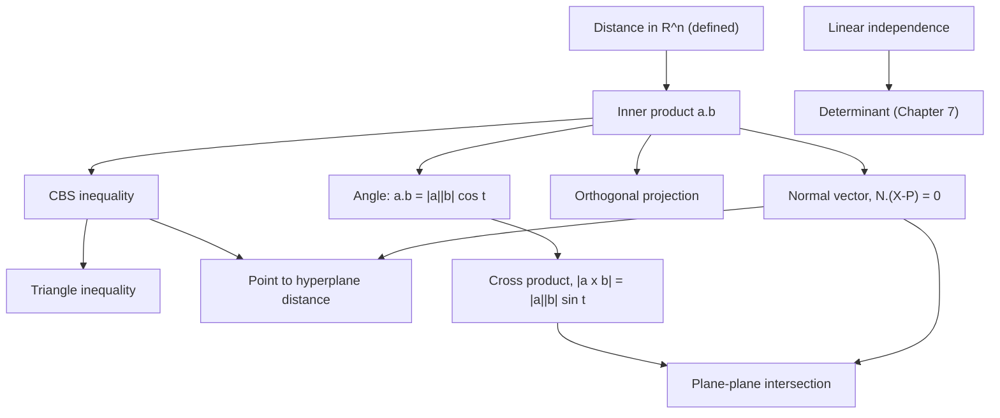

## What this unit answers

The first half of the course was analysis: limits, series, approximation. This
unit changes subject. It asks what it means to *do geometry with coordinates* —
and then builds the algebraic machinery, the vector, that makes geometry in
$$\mathbb{R}^n$$ computable.

It covers two textbook chapters, and they divide cleanly. **Part 1** (Chapter 4)
is about coordinate systems: what $$\mathbb{R}^n$$ is, and how the polar,
cylindrical and spherical systems describe the same space differently. **Part 2**
(Chapter 5) is about vectors: the inner product and everything it yields —
angles, projections, the Cauchy–Schwarz and triangle inequalities, distances to
planes — then the cross product, lines and hyperplanes, centre of mass, and
linear independence.

The two halves meet in one idea. A coordinate system is a way of *naming* points;
a vector is a way of *relating* them. Naming is a choice, and the right choice
makes a curve trivial or intractable. Relating is structural, and every metric
fact in this unit comes from a single structure, the inner product.

## Prerequisites

Almost nothing from Units 1 to 3. This unit is self-contained, which makes it a
good place to come back to. It needs secondary-school trigonometry, and one
derivative, in the proof that the orthogonal projection minimises distance.

What it does need is a willingness to treat $$\mathbb{R}^n$$ as a *place* rather
than a set of tuples, which the lectures were explicit about.

---

## Part 1 — Chapter 4: coordinate systems

### Coordinate space as a geometric object

The correspondences are the familiar ones:

$$
\begin{aligned}
\text{plane} &\leftrightarrow \mathbb{R}^2 = \{(x, y) : x, y \in \mathbb{R}\}, \\
\text{space} &\leftrightarrow \mathbb{R}^3 = \{(x, y, z) : x, y, z \in \mathbb{R}\}.
\end{aligned}
$$

The lectures were careful about what that arrow means. It is not merely a
bijection between sets. It matches $$\mathbb{R}^2$$ and $$\mathbb{R}^3$$ with the
*geometric* objects called the plane and space. So we agree to see
$$\mathbb{R}^2$$ and $$\mathbb{R}^3$$ not as collections of ordered pairs but as
geometric things — and then, by the same agreement,

$$
\text{$n$-space} \leftrightarrow \mathbb{R}^n = \{(x_1, \ldots, x_n) : x_i \in \mathbb{R}\}
$$

as a geometric object too. We cannot look at it, which is frustrating; the
lecture's phrase was that we insist we see it with the mind's eye and get on with
the mathematics.

Two operations, addition and scalar multiplication:

$$
\begin{aligned}
(a_1, \ldots, a_n) + (b_1, \ldots, b_n) &= (a_1 + b_1, \ldots, a_n + b_n), \\
k(a_1, \ldots, a_n) &= (ka_1, \ldots, ka_n).
\end{aligned}
$$

Read geometrically: **addition is translation, and scalar multiplication
stretches the distance from the origin.** That reading is the whole reason for
caring about either.

Distance is *defined*, not derived:

$$
\begin{aligned}
\lvert A \rvert &= \sqrt{a_1^2 + \cdots + a_n^2}, \\
\lvert A - B \rvert &= \sqrt{(a_1 - b_1)^2 + \cdots + (a_n - b_n)^2}.
\end{aligned}
$$

> Each of these definitions has a context that justifies it, and the lectures
> said plainly there was no time for it: mathematicians before us thought hard
> about this, and when it is time to trust that thinking, trust it. We do not
> have to redo every worry our predecessors had.
{: .prompt-tip }

One payoff is worth recording now, because Chapter 5 states it: with distance
defined this way, **Pythagoras holds on every two-dimensional plane sitting
inside $$n$$-space.** The definition was chosen so that it would.

### Polar coordinates

The polar system assigns to the plane a different set of names:

$$
\mathbb{R}^2 = \left\{\begin{pmatrix} x \\ y \end{pmatrix}\right\}
\leftrightarrow
\left\{\begin{pmatrix} r \\ \theta \end{pmatrix} : x = r\cos\theta,\ y = r\sin\theta \right\}
$$

with the relations

$$
\begin{aligned}
x &= r\cos\theta, \quad y = r\sin\theta, \\
r^2 &= x^2 + y^2, \\
\cos\theta = \frac{x}{r}, \quad &\sin\theta = \frac{y}{r}, \quad \tan\theta = \frac{y}{x}.
\end{aligned}
$$

Writing $$(\cdot)_{\mathrm{rect}}$$ and $$(\cdot)_{\mathrm{pol}}$$ for the two
readings of a pair:

$$
\begin{aligned}
\left(1, \sqrt{3}\right)_{\mathrm{rect}} &= \left(2, \tfrac{\pi}{3}\right)_{\mathrm{pol}}, \\
\left(2, \tfrac{3\pi}{4}\right)_{\mathrm{pol}} &= \left(-\sqrt{2}, \sqrt{2}\right)_{\mathrm{rect}}.
\end{aligned}
$$

**Negative $$r$$ is allowed**, and the convention is worth pausing on:

$$
(-r, \theta)_{\mathrm{pol}} = -(r\cos\theta,\ r\sin\theta)_{\mathrm{rect}}.
$$

So $$(-r, \theta)$$ is the point you reach by facing in the direction $$\theta$$
and walking *backwards* a distance $$r$$. For instance

$$
\left(-2, \tfrac{3\pi}{4}\right)_{\mathrm{pol}} = \left(\sqrt{2}, -\sqrt{2}\right)_{\mathrm{rect}}.
$$

### Curves in polar form

A curve in rectangular coordinates, $$g(x, y) = 0$$ or $$y = f(x)$$, is a
relation between $$x$$ and $$y$$. A curve in polar coordinates,
$$g(r, \theta) = 0$$ or $$r = f(\theta)$$, is a relation between $$r$$ and
$$\theta$$. Nothing more, and the two look nothing alike:

- **Line through the origin.** $$y = kx$$ becomes $$\theta = \theta_0$$.
- **Line parallel to the $$y$$-axis.** $$x = d$$ becomes $$r = d/\cos\theta$$.
- **General line.** $$ax + by + c = 0$$ becomes
  $$r = -c / (a\cos\theta + b\sin\theta)$$.
- **Circle centred at the origin.** $$x^2 + y^2 = d^2$$ becomes $$r = d$$.
- **Circle through the origin, tangent to the $$y$$-axis.**
  $$x^2 - x + y^2 = 0$$ becomes $$r = \cos\theta$$.

The general line is, as the lectures put it, not pretty. The last row is the
pretty one. Starting from $$x^2 - x + y^2 = 0$$, which is
$$(x - \tfrac12)^2 + y^2 = (\tfrac12)^2$$:

$$
\begin{aligned}
(r\cos\theta)^2 - r\cos\theta + (r\sin\theta)^2 &= 0 \\
r &= \cos\theta,
\end{aligned}
$$

on $$-\pi/2 \le \theta \le \pi/2$$. If you already know that a diameter subtends
an angle of $$\pi$$, this formula is immediate from the picture.

> The conversion is easy in exactly one direction. Rectangular to polar is
> substitution: $$g(x,y) = 0$$ becomes $$g(r\cos\theta, r\sin\theta) = 0$$, and
> you are done. Polar to rectangular is in general hard or messy. That asymmetry
> is the whole justification for having a polar system at all — the curves below
> are awkward or impossible to write in $$x$$ and $$y$$.
{: .prompt-info }

### The polar menagerie

| Curve | Equation |
|---|---|
| Archimedean spiral | $$r = k\theta$$ |
| Hyperbolic spiral | $$r = k / \theta$$ |
| Cardioid | $$r = 1 + \cos\theta$$ |
| Logarithmic (equiangular) spiral | $$r = ke^{\theta}$$ |
| Four-petal rose | $$r = \sin 2\theta$$ |
| Three-petal rose | $$r = \sin 3\theta$$ |

The Archimedean spiral leaves the origin cleanly. The hyperbolic spiral winds
around the origin infinitely often — the lecture's note on the name was simply
that he does not know why it is called that. The cardioid is heart-shaped,
which is where the name comes from.

The roses invite a conjecture: $$r = \sin n\theta$$ has $$2n$$ petals when $$n$$
is even and $$n$$ petals when $$n$$ is odd. That is correct, and the lectures
left the reason as an exercise for anyone with time. One more curve,
$$r = 1 + 2\cos\theta$$, appeared without a name attached; the advice given was
to type it into a search engine, which remains good advice.

### Scaling and rotation

Two transformation rules, both one line:

$$
\begin{aligned}
r = k\,f(\theta) \quad &\text{is } r = f(\theta) \text{ scaled by } k \text{ about the origin}, \\
r = f(\theta - \alpha) \quad &\text{is } r = f(\theta) \text{ rotated by } \alpha.
\end{aligned}
$$

Applying the second to the table above gives the general forms directly:

$$
\begin{aligned}
\text{line at distance } d \text{ from the origin:} \quad & r = \frac{d}{\cos(\theta - \alpha)}, \\
\text{circle through the origin:} \quad & r = d\cos(\theta - \alpha).
\end{aligned}
$$

And it explains the name *equiangular*. Rotate $$r = e^{\theta}$$ by
$$\alpha$$:

$$
r = e^{\theta} \longrightarrow r = e^{\theta - \alpha} = e^{-\alpha}e^{\theta},
$$

which is the same curve scaled by $$e^{-\alpha}$$. **Rotating it is
indistinguishable from scaling it**, so the curve is self-similar about the
origin — and a curve meeting every ray from the origin at the same angle is the
only thing that can behave that way.

Two physical appearances the lectures offered. Four cockroaches each walking
directly toward the next trace a *pursuit curve*, which is the equiangular
spiral $$r = e^{\theta}$$. A cockroach walking at constant speed from the centre
of a turning record toward a mark on its rim traces the Archimedean spiral.

### An aside on coordinates and the Greeks

Can the following be done with straightedge and compass in finitely many steps?

1. **Duplicating the cube** — draw an edge of a cube of volume $$2$$.
2. **Squaring the circle** — draw a square of the same area as a given circle.
3. **Trisecting an angle** — divide a given angle into three equal parts.

All three are impossible, and the impossibility is *proved*. These are the three
classical construction problems. The lectures noted, with some amusement, that
people still turn up claiming a trisection.

Someone in ancient Greece showed that *if you are handed the graph of*
$$y = x^2$$, duplicating the cube becomes possible — but you cannot draw the
parabola. That was the first meeting between the parabola and humankind, and
also the first meeting between rectangular coordinates and humankind. They
parted immediately. The Greeks did not notice how useful coordinates were,
partly because they were captivated by the beauty of doing geometry with no
coordinate system at all.

> The lectures suggested this may have been fortunate. Had humanity taken up
> coordinates early, we might never have seen Euclidean geometry done the Greek
> way. Coordinates returned much later through Descartes — which is why they are
> called *Cartesian*, Cart's coordinates — and the relationship has lasted
> centuries since.
{: .prompt-tip }

### Conic sections

About 2200 years ago Apollonius of Perga, apparently with time on his hands,
cut a cone with a plane. Euclid had done the same. Depending on the cut you get
an **ellipse**, a **parabola** or a **hyperbola** — hence *conic sections*.
Apollonius found the characterisations still taught in school:

1. An ellipse is the set of points whose distances to two points have constant **sum**.
2. A parabola is the set of points equidistant from a point and a line.
3. A hyperbola is the set of points whose distances to two points have constant **difference**.

Some five centuries later Pappus found a single statement covering all three:

> A conic section is the set of points for which the ratio of the distance to a
> fixed point (the **focus**) and the distance to a fixed line (the
> **directrix**) is a constant $$\epsilon : 1$$.
{: .prompt-info }

That constant is the **eccentricity**, and it classifies the curve:

$$
\begin{aligned}
0 \le \epsilon < 1 \ &\Longrightarrow\ \text{ellipse}, \\
\epsilon = 1 \ &\Longrightarrow\ \text{parabola}, \\
\epsilon > 1 \ &\Longrightarrow\ \text{hyperbola}.
\end{aligned}
$$

Once humanity had polar coordinates, Pappus's description became a formula.
With $$d$$ the focus-to-directrix distance,

$$
r = \frac{\epsilon d}{1 + \epsilon\cos\theta},
$$

which is the form used to show that a planetary orbit is a conic. In rectangular
coordinates the same three curves are the familiar

$$
\begin{aligned}
\text{ellipse:} \quad & \frac{x^2}{a^2} + \frac{y^2}{b^2} = 1, \\
\text{parabola:} \quad & y^2 = 4px, \\
\text{hyperbola:} \quad & \frac{x^2}{a^2} - \frac{y^2}{b^2} = 1,
\end{aligned}
$$

which is why conics are also called **quadratic curves**. And the general
quadratic

$$
ax^2 + by^2 + cxy + ex + fy + g = 0
$$

is always a conic section. Seeing why needs the diagonalisation of symmetric
matrices from linear algebra, which first-year mathematics does not cover.

**Where the word "focus" comes from.** Apollonius called the point merely a
noteworthy one. Kepler later claimed that Mars orbits in an ellipse with the Sun
at such a point. *Focus* is Latin for *fireplace* — the place where the fire
is — and the point where a lens gathers sunlight is a focus for the same reason.
The East Asian translation 焦点 uses 焦, to scorch, the same character as in
焦土化, scorched earth. Different languages, same observation about heat.

> The lectures closed this digression by pointing out that the previous few pages
> contain a feast of reason spread over more than two thousand years, and asking
> whether that is not thrilling. It is a fair question to put to a page of
> formulas.
{: .prompt-tip }

### Cylindrical and spherical coordinates

Two more naming schemes, this time for $$\mathbb{R}^3$$:

$$
\begin{aligned}
\begin{pmatrix} r \\ \theta \\ z \end{pmatrix}_{\mathrm{cyl}}
&= \begin{pmatrix} r\cos\theta \\ r\sin\theta \\ z \end{pmatrix}_{\mathrm{rect}}, \\[1ex]
\begin{pmatrix} \rho \\ \varphi \\ \theta \end{pmatrix}_{\mathrm{sph}}
&= \begin{pmatrix} \rho\sin\varphi\cos\theta \\ \rho\sin\varphi\sin\theta \\ \rho\cos\varphi \end{pmatrix}_{\mathrm{rect}}.
\end{aligned}
$$

Here $$\varphi$$ is measured from the positive $$z$$-axis and $$\theta$$ around
it. Converting:

$$
\begin{aligned}
\left(1, \sqrt{3}, 0\right)_{\mathrm{rect}} &= \left(2, \tfrac{\pi}{3}, 0\right)_{\mathrm{cyl}}, \\
\left(-1, -1, -1\right)_{\mathrm{rect}} &= \left(\sqrt{2}, \tfrac{5\pi}{4}, -1\right)_{\mathrm{cyl}}, \\
\left(1, \sqrt{3}, 0\right)_{\mathrm{rect}} &= \left(2, \tfrac{\pi}{2}, \tfrac{\pi}{3}\right)_{\mathrm{sph}}, \\
\left(-1, -1, -1\right)_{\mathrm{rect}} &= \left(\sqrt{3}, \arccos\tfrac{-1}{\sqrt{3}}, \tfrac{5\pi}{4}\right)_{\mathrm{sph}}.
\end{aligned}
$$

**Counting equations.** In a coordinate system for three-dimensional space, one
equation describes a surface and two equations describe the curve where two
surfaces meet. That rule organises everything below.

- **The unit sphere** is $$x^2 + y^2 + z^2 = 1$$ in rectangular coordinates,
  $$r^2 + z^2 = 1$$ in cylindrical, and simply $$\rho = 1$$ in spherical.
- **The cap $$z \ge \tfrac{\sqrt3}{2}$$ of that sphere** keeps the inequality
  on $$z$$ in the first two systems, but in spherical coordinates it is
  $$\rho = 1$$ with $$\varphi \le \tfrac{\pi}{3}$$.

The spherical column is the point of the table: a condition that needs an
inequality on $$z$$ in the other two systems becomes a bound on a single
coordinate, $$\varphi \le \pi/3$$.

A few more surfaces. $$r = 1$$ is a circular cylinder; so is $$r = \cos\theta$$;
and $$\theta = 2$$ is a vertical plane.

**Worked example: when intuition is not available.** The surface
$$\rho = \cos\varphi$$ is the sphere of diameter $$1$$ tangent to the
$$xy$$-plane at the origin. You can see that geometrically if you are lucky.
Since intuition is not always on hand, the algebra is the comfortable route:

$$
\begin{aligned}
\rho = \cos\varphi \ &\Longrightarrow\ \rho^2 = \rho\cos\varphi \\
&\Longrightarrow\ x^2 + y^2 + z^2 = z \\
&\Longrightarrow\ x^2 + y^2 + \left(z - \tfrac12\right)^2 = \left(\tfrac12\right)^2.
\end{aligned}
$$

**Worked example: a curve as two surfaces.** Show that

$$
\begin{aligned}
&x^2 + y^2 + z^2 = 1 \ \text{ and } \ x^2 - x + y^2 = 0 \\
&\iff \rho = 1 \ \text{ and } \ \varphi \pm \theta = \tfrac{\pi}{2},
\end{aligned}
$$

on $$0 \le \varphi \le \pi/2$$. That $$\rho = 1$$ is immediate. For the second,
substitute $$(x, y, z) = (\sin\varphi\cos\theta, \sin\varphi\sin\theta, \cos\varphi)$$:

$$
\begin{aligned}
x^2 - x + y^2 &= 0 \\
\sin^2\varphi\left(\cos^2\theta + \sin^2\theta\right) - \sin\varphi\cos\theta &= 0 \\
\sin\varphi = \cos\theta &= \sin\left(\tfrac{\pi}{2} - \theta\right),
\end{aligned}
$$

so $$\varphi = \pi/2 - \theta$$ or $$\varphi = \pi/2 + \theta$$.

> The surface $$\varphi \pm \theta = \pi/2$$ on its own is a genuine surface, and
> the lectures admitted to not being sure what it looks like, noting only that it
> is related to the Möbius band and advising against digging further. An honest
> boundary marker is more useful than a confident wrong answer.
{: .prompt-warning }

The closing remark of the chapter: these are a handful of surfaces, and just as
you cannot sketch an arbitrary curve from its rectangular equation, you cannot
sketch an arbitrary surface either. Earlier generations suffered to produce a
single picture. We have computers that draw them for us — whether that makes
this a better world or a worse one was left open.

---

## Part 2 — Chapter 5: vectors

### Translation and isometries

For a fixed point $$v$$, the map

$$
T_v : \mathbb{R}^n \to \mathbb{R}^n, \qquad T_v(X) = X + v
$$

is the **$$v$$-translation**. An **isometry** is a map that preserves distance —
a rigid motion. The classification is striking and was stated without proof.

Every isometry of $$\mathbb{R}^2$$ is a translation composed with a rotation, or
a translation composed with a reflection. Every isometry of $$\mathbb{R}^3$$ is a
translation composed with a rotation, or a translation composed with a reflection
in a plane and then a rotation. That is the complete list, in both cases.

The lectures' comment was that this gets handled once you are grown up, and that
the course is at the entrance of the road to being able to handle it.

### Directed segments, and what a vector is

A **directed segment** is a segment with a direction — an arrow
$$\overrightarrow{AB}$$. Two vectors are **equal** when some translation makes
them coincide.

That definition creates a small philosophical mess, which the lectures handled
bluntly. A *free vector* is said to have neither an initial nor a terminal
point; the lecturer's remark was that this is not a notion he finds friendly
either, and that arrows, as drawn, do have both. The working resolution is the
**position vector**: among all arrows equal to a given one, take the one based at
the origin as the representative. That makes vectors and points correspond.

With that correspondence, vector addition is geometric — follow the arrows in
sequence, from the first initial point to the last terminal point — and it agrees
with adding the corresponding points. The same holds for scalar multiples. In
coordinates:

$$
\overrightarrow{AB} = B - A, \qquad
\bigl\lvert \overrightarrow{AB} \bigr\rvert = \lvert B - A \rvert.
$$

A few conventions, all of which the notes flag as conventions rather than
content:

- **Notation.** These notes, like most textbooks, write vectors in **bold**
  rather than with an arrow over the letter.
- **Unit vector and normalisation.** A vector of length $$1$$ is a unit vector.
  Since $$\lvert (1,2,3) \rvert = \sqrt{14}$$, normalising gives
  $$\tfrac{1}{\sqrt{14}}(1,2,3)$$.
- **Standard unit vectors.** $$e_1 = i = \hat{x}$$, $$e_2 = j = \hat{y}$$,
  $$e_3 = k = \hat{z}$$.
- **Parallel.** $$v \parallel w \iff v = kw$$ or $$w = kv$$ for a scalar $$k$$.
  Both clauses are needed, so that the zero vector is parallel to everything.

### The inner product

A note on names, which the lectures enjoyed. *Product* means both a manufactured
article and a multiplication; 내적 is a literal rendering of *inner product*,
where 積 means *to pile up* but also *to multiply*. Later in the course 외적
arrives for *cross product* or *vector product*, which is a loose translation —
and the lecturer's position was that a loose translation is not the same as a bad
one, and that he likes this one.

**Definition.** For $$a = (a_1, \ldots, a_n)$$ and $$b = (b_1, \ldots, b_n)$$ in
$$\mathbb{R}^n$$, the **dot product** or **standard inner product** is

$$
a \cdot b = \sum_{i=1}^{n} a_i b_i .
$$

**Theorem.** For vectors $$a, \tilde{a}, b$$ and scalars $$c, \tilde{c}$$:

1. $$a \cdot b = b \cdot a$$ — **symmetric**.
2. $$(ca + \tilde{c}\tilde{a}) \cdot b = c(a \cdot b) + \tilde{c}(\tilde{a} \cdot b)$$ — **bilinear**.
3. $$a \cdot a \ge 0$$, with equality exactly when $$a = 0$$ — **positive definite**.

Bilinearity in the second slot follows from the first two together, which is
why only one side is stated. The **norm** is then defined from the product:

$$
\lVert v \rVert = \sqrt{v \cdot v}.
$$

Two identities worth having, both immediate from bilinearity:

$$
\begin{aligned}
a \cdot b &= \tfrac12\left(\lvert a + b\rvert^2 - \lvert a \rvert^2 - \lvert b \rvert^2\right), \\
\lvert a + b\rvert^2 + \lvert a - b\rvert^2 &= 2\left(\lvert a \rvert^2 + \lvert b \rvert^2\right).
\end{aligned}
$$

The second is the **parallelogram law**: the sum of the squares of a
parallelogram's diagonals equals the sum of the squares of its four sides.

### Cauchy–Bunyakovsky–Schwarz

**Theorem.** For any two vectors,

$$
\lvert a \cdot b \rvert \le \lvert a \rvert \lvert b \rvert,
$$

with equality exactly when $$a$$ and $$b$$ are parallel.

*Proof.* For every real $$t$$, positive definiteness gives

$$
0 \le (b + ta) \cdot (b + ta) = (a \cdot a)t^2 + 2(a \cdot b)t + b \cdot b .
$$

A quadratic in $$t$$ that is never negative has non-positive discriminant:

$$
\frac{D}{4} = (a \cdot b)^2 - (a \cdot a)(b \cdot b) \le 0,
$$

which is the inequality. And $$D/4 = 0$$ says some $$t_0$$ makes
$$(b + t_0 a) \cdot (b + t_0 a) = 0$$, hence $$b + t_0 a = 0$$ — the two vectors
are parallel. $$\square$$

In coordinates the same statement reads

$$
\left(\sum a_i b_i\right)^2 \le \left(\sum a_i^2\right)\left(\sum b_i^2\right),
$$

which is the form to reach for in an inequality problem.

### Worked examples: CBS as a distance machine

**Distance from a point to a line.** The distance from $$(x_0, y_0)$$ to the line
$$ax + by + c = 0$$ is

$$
\frac{\lvert ax_0 + by_0 + c \rvert}{\sqrt{a^2 + b^2}}.
$$

For any $$(x, y)$$ on the line, CBS gives

$$
\begin{aligned}
&\left\{(x - x_0)^2 + (y - y_0)^2\right\}\left(a^2 + b^2\right) \\
&\qquad \ge \left\{a(x - x_0) + b(y - y_0)\right\}^2 = (ax_0 + by_0 + c)^2,
\end{aligned}
$$

using $$ax + by = -c$$ at the last step. The left factor is the squared distance
to an arbitrary point of the line, so the smallest it can be is the right-hand
side divided by $$a^2 + b^2$$.

**Distance from a point to a plane.** Identically, the distance from
$$(x_0, y_0, z_0)$$ to $$ax + by + cz + d = 0$$ is

$$
\frac{\lvert ax_0 + by_0 + cz_0 + d \rvert}{\sqrt{a^2 + b^2 + c^2}}.
$$

**An inequality with no geometry in sight.** Given $$x^2 + 2y^2 + 3z^2 = 1$$,
find the range of $$x + y + z$$. Write the sum as a dot product of
$$(x, \sqrt2 y, \sqrt3 z)$$ with $$(1, \tfrac{1}{\sqrt2}, \tfrac{1}{\sqrt3})$$
and apply CBS:

$$
(x + y + z)^2 \le \left(x^2 + 2y^2 + 3z^2\right)\left(1 + \tfrac12 + \tfrac13\right) = \tfrac{11}{6}.
$$

The same trick handles any quadratic constraint. Choosing how to split the
factors is the whole skill.

### Triangle inequality, projection, angle

**Theorem (triangle inequality).**

$$
\lvert a \rvert - \lvert b \rvert \le \lvert a + b \rvert \le \lvert a \rvert + \lvert b \rvert,
$$

each with equality exactly when $$a$$ and $$b$$ are parallel. Both halves follow
by squaring and applying CBS to the cross term.

**Theorem (orthogonal projection).** For $$a \ne 0$$, the projection of $$b$$ onto
$$a$$ is

$$
P_a(b) = \frac{a \cdot b}{a \cdot a}\, a .
$$

*Proof.* $$P_a(b)$$ must be parallel to $$a$$, so write it as $$ta$$ and choose
$$t$$ to minimise the distance. With

$$
f(t) = \lvert b - ta \rvert^2 = (a \cdot a)t^2 - 2(a \cdot b)t + b \cdot b,
$$

we get $$f'(t) = 2(a \cdot a)t - 2(a \cdot b)$$, which vanishes at
$$t = (a \cdot b)/(a \cdot a)$$. $$\square$$

Note what that proof is: the projection is *defined* as the nearest point, and
the formula is the result of a one-variable minimisation. It is the only
derivative in the chapter.

**Theorem.** For non-zero $$a, b$$,

$$
a \cdot b = \lvert a \rvert \lvert b \rvert \cos\theta .
$$

This is where the angle enters. Everything before it was algebra; this identity
is what licenses the word "angle" in $$\mathbb{R}^n$$, where no protractor
exists.

> **Pythagoras is the assumption, not the conclusion.** From the identity above,
> $$a \cdot b = 0 \iff \lvert a - b \rvert^2 = \lvert a \rvert^2 + \lvert b \rvert^2$$,
> and it is tempting to call that an easy proof of Pythagoras. The lectures were
> emphatic that this is a mistake. Everything we have done rests *on* Pythagoras
> — it is built into the definition of distance we adopted in Chapter 4.
> Euclidean geometry starts from Pythagoras. Deriving it from the law of cosines
> has the same circularity, and the lecturer reported having met people who
> tried.
{: .prompt-warning }

With the angle available:

$$
\begin{aligned}
\text{law of cosines:} \quad & \lvert a - b\rvert^2 = \lvert a \rvert^2 + \lvert b \rvert^2 - 2\,a \cdot b, \\
\text{parallelogram area:} \quad & \sqrt{\lvert a \rvert^2 \lvert b \rvert^2 - (a \cdot b)^2}.
\end{aligned}
$$

### Worked example: the methane bond angle

The $$\mathrm{H} - \mathrm{C} - \mathrm{H}$$ angle in $$\mathrm{CH}_4$$ is
$$\arccos\left(-\tfrac13\right) \approx 109.5^\circ$$. Three routes were given,
and the third is the one worth keeping.

1. The points $$(0,0,0)$$, $$(0,1,1)$$, $$(1,0,1)$$, $$(1,1,0)$$ are the vertices
   of a regular tetrahedron, with centre $$(\tfrac12, \tfrac12, \tfrac12)$$.
2. In $$\mathbb{R}^4$$, the points $$(1,0,0,0)$$, $$(0,1,0,0)$$, $$(0,0,1,0)$$,
   $$(0,0,0,1)$$ are the vertices of a regular tetrahedron with centre
   $$(\tfrac14, \tfrac14, \tfrac14, \tfrac14)$$ — easier than the
   three-dimensional version, which is a good argument for not fearing
   $$\mathbb{R}^4$$.
3. Purely with vectors. For four unit vectors from the centre to the vertices,

$$
\begin{aligned}
a_1 + a_2 + a_3 + a_4 &= 0, \\
a_i \cdot a_j &\equiv \text{constant} \quad (i \ne j).
\end{aligned}
$$

Squaring the first and expanding:
$$0 = 4 + 12\,a_i \cdot a_j$$, so $$a_i \cdot a_j = -\tfrac13$$, and since the
vectors are unit vectors that dot product *is* $$\cos\theta$$.

### The cross product

> Chapter 8 is where the cross product formally belongs. The lectures declined to
> wait, on the grounds that everyone knows it already, and did it here.
{: .prompt-info }

**Definition.** For $$a = (a_1, a_2, a_3)$$ and $$b = (b_1, b_2, b_3)$$ in
$$\mathbb{R}^3$$, the cross product $$a \times b$$ has components

$$
\begin{aligned}
(a \times b)_1 &= a_2 b_3 - a_3 b_2, \\
(a \times b)_2 &= a_3 b_1 - a_1 b_3, \\
(a \times b)_3 &= a_1 b_2 - a_2 b_1 .
\end{aligned}
$$

Each line is the one below it with the indices advanced cyclically, which is the
easiest way to remember it.

Note the shape: it takes two vectors in $$\mathbb{R}^3$$ and returns a vector in
$$\mathbb{R}^3$$, unlike the inner product, which returns a scalar and works in
every dimension.

**Properties.**

0. $$i \times j = k$$, $$j \times k = i$$, $$k \times i = j$$.
1. $$a \times b = -\,b \times a$$ — **anti-symmetric**.
2. $$(c_1 a_1 + c_2 a_2) \times b = c_1(a_1 \times b) + c_2(a_2 \times b)$$ — **bilinear**.
3. $$(a \times b) \cdot a = 0$$ and $$(a \times b) \cdot b = 0$$ — perpendicular to both.
4. $$\lvert a \times b \rvert = \sqrt{\lvert a \rvert^2 \lvert b \rvert^2 - (a \cdot b)^2} = \lvert a \rvert \lvert b \rvert \sin\theta$$ — the area of the parallelogram. In particular $$a \parallel b \Rightarrow a \times b = 0$$.
5. $$a$$, $$b$$, $$a \times b$$ are **positively oriented**.

Property 4 next to the parallelogram area above is the point: the inner product
measures the parallelogram's *defect* from a right angle, and the cross product
measures its area. The same two numbers, read two ways.

**How recent this is.** The cross product was defined only in the 1880s, which
is startling given how useful it turned out to be. The lectures offered one
measure of that usefulness: Maxwell's equations were originally written as eight
equations, and before the cross product existed nobody noticed that the eight
were not independent.

Two appearances in mechanics:

$$
\begin{aligned}
\text{torque about the origin from force } f \text{ at } r: \quad & r \times f, \\
\text{angular velocity } a \text{ and position } r: \quad & a \times r = r' .
\end{aligned}
$$

### Hyperplanes

**Definition.** The points of $$\mathbb{R}^n$$ satisfying a single linear
equation

$$
a_1(x_1 - b_1) + a_2(x_2 - b_2) + \cdots + a_n(x_n - b_n) = 0
$$

form a **hyperplane**. It passes through $$P = (b_1, \ldots, b_n)$$ and is
perpendicular to $$N = (a_1, \ldots, a_n)$$, the **normal vector**. In vector
form the equation collapses to

$$
N \cdot (X - P) = 0 \qquad \text{or} \qquad N \cdot X = c .
$$

That is the whole content of "plane", in any dimension, in one dot product.

- In $$\mathbb{R}^2$$, $$a(x-1) + b(y-2) = 0$$ passes through $$(1,2)$$ with
  normal $$(a,b)$$ — a line.
- In $$\mathbb{R}^3$$, $$a(x-1) + b(y-2) + c(z-3) = 0$$ passes through
  $$(1,2,3)$$ with normal $$(a,b,c)$$ — a plane.
- In $$\mathbb{R}^3$$, $$a(x-1) + b(y-2) = 0$$ passes through $$(1, 2, z)$$ for
  every $$z$$, with normal $$(a,b,0)$$ — still a plane, a vertical one.
- In $$\mathbb{R}^4$$, $$a(x-1) + b(y-2) + c(z-3) + d(w-4) = 0$$ passes through
  $$(1,2,3,4)$$ with normal $$(a,b,c,d)$$.

The third row is worth reading twice: in $$\mathbb{R}^3$$ an equation with no
$$z$$ in it is still a hyperplane — a vertical plane — not a line. What a linear
equation cuts out depends on the ambient space. As for the $$\mathbb{R}^4$$ row,
the lectures' answer to "what does it look like?" was that it looks like
$$\mathbb{R}^3$$.

A hyperplane in $$\mathbb{R}^n$$ is congruent to $$\mathbb{R}^{n-1}$$. Congruent
means an isometry between them exists, and producing it is second-year
mathematics, not first.

**Distance from a hyperplane to a point.** For the hyperplane
$$N \cdot (X - P) = 0$$ and a point $$Q$$,

$$
\frac{\lvert N \cdot (Q - P) \rvert}{\lvert N \rvert},
$$

which is the point-to-plane formula already proved by CBS, now in coordinate-free
form. For a **unit** normal $$n$$, the signed distance from $$n \cdot X = c$$ to
the origin is simply $$c$$.

<!-- The notes leave this as an open question: what is the relationship between
     the direction of the unit normal n and the sign of c? Worth answering in
     your own words if you want a short addition here. -->

### Lines

A line through $$P$$ with direction $$v$$ has the **parametric equation**

$$
X(t) = P + tv \qquad (t \in \mathbb{R}),
$$

and both $$P$$ and $$v$$ are vectors while $$t$$ is a scalar. Eliminating $$t$$
gives the symmetric form:

$$
\begin{aligned}
(x, y) = (1,2) + t(3,4) \ &\Longrightarrow\ \frac{x-1}{3} = \frac{y-2}{4}, \\
(x, y, z) = (1,2,3) + t(4,5,6) \ &\Longrightarrow\ \frac{x-1}{4} = \frac{y-2}{5} = \frac{z-3}{6}.
\end{aligned}
$$

> That second line is **two** independent equations, not one. Each is the
> equation of a hyperplane, so the symmetric form exhibits the line as the
> intersection of two planes. This is the counting rule from Chapter 4 again: in
> $$\mathbb{R}^3$$, one equation gives a surface and two give a curve.
{: .prompt-tip }

A zero in the direction vector has to be handled separately, since you cannot
divide by it:

$$
(x,y,z) = (1,2,3) + t(4,5,0) \ \Longrightarrow\ \frac{x-1}{4} = \frac{y-2}{5}, \quad z = 3 .
$$

For the line through two points $$A$$ and $$B$$, two equivalent forms:

$$
X(t) = (1-t)A + tB \qquad \text{or} \qquad X = sA + tB, \ \ s + t = 1 .
$$

In this form $$t$$ acts as a uniform coordinate along the line.

### Worked examples: intersections and distances

**Line meets plane.** Find where the plane $$x + 2y + 3z + 4 = 0$$ meets the line
through $$(1,2,3)$$ with direction $$(4,5,6)$$. Substitute the parametrisation
$$(x,y,z) = (1+4t,\ 2+5t,\ 3+6t)$$ into the plane equation:

$$
\begin{aligned}
(1+4t) + 2(2+5t) + 3(3+6t) + 4 &= 0 \\
18 + 32t &= 0,
\end{aligned}
$$

so $$t = -\tfrac{9}{16}$$ and the intersection point is

$$
\left(-\tfrac{5}{4},\ -\tfrac{13}{16},\ -\tfrac{3}{8}\right).
$$

**Plane meets plane.** Find the intersection of $$x + 2y - 3z + 4 = 0$$ and
$$3x + 5y - 4z + 2 = 0$$. Three answers of increasing quality:

*Answer 1.* The two equations themselves. Correct, and the lectures refused to
accept it — do not take the easy way; find a point and a direction.

*Answer 2.* Solve for $$x$$ and $$y$$ in terms of $$z$$:

$$
\begin{aligned}
\begin{cases} x + 2y = 3z - 4 \\ 3x + 5y = 4z - 2 \end{cases}
\ &\Longrightarrow\
\begin{cases} x = -7z + 16 \\ y = 5z - 10 \end{cases}
\end{aligned}
$$

so the line is

$$
(x,y,z) = (16, -10, 0) + t(-7, 5, 1),
$$

or in symmetric form $$\dfrac{x - 16}{-7} = \dfrac{y + 10}{5} = z$$.

*Answer 3.* The direction is perpendicular to both normals, so take their cross
product:

$$
d = (1, 2, -3) \times (3, 5, -4) = (7, -5, -1),
$$

which is $$-(-7,5,1)$$ — the same direction, as it must be. This is the fastest
route, and it is only available because the cross product was introduced early.

**Distance between parallel planes.** For $$x + 2y - 3z = 4$$ and
$$x + 2y - 3z = -3$$:

$$
\frac{4 - (-3)}{\sqrt{1^2 + 2^2 + (-3)^2}} = \frac{7}{\sqrt{14}} .
$$

**Distance between a plane and a line.** For the plane $$x + 2y - 3z = 4$$ and
the line $$\dfrac{x-3}{5} = \dfrac{y+2}{2} = \dfrac{z+1}{3}$$, first check that
the question makes sense: $$(1,2,-3) \cdot (5,2,3) = 0$$, so the line is parallel
to the plane and the distance is well defined. Then it reduces to the distance
from any one point of the line to the plane. As the notes say, this one is very
easy — provided you check the dot product first.

**Common perpendicular of skew lines.** For
$$\dfrac{x}{2} = \dfrac{y+1}{3} = \dfrac{z-1}{2}$$ and
$$\dfrac{x-3}{5} = \dfrac{y+2}{2} = \dfrac{z+1}{3}$$, take a point on each,

$$
\begin{aligned}
A &= (2t,\ 3t - 1,\ 2t + 1), \\
B &= (5s + 3,\ 2s - 2,\ 3s - 1),
\end{aligned}
$$

and impose perpendicularity to both directions:

$$
\overrightarrow{AB} \cdot (2,3,2) = 0
\quad \text{and} \quad
\overrightarrow{AB} \cdot (5,2,3) = 0 .
$$

Two linear equations in $$s$$ and $$t$$. No geometry required beyond writing down
what "perpendicular to both" means.

### Centre of mass

> The lectures introduced this section by saying to take it as entertainment.
> It is also the part of the chapter that argues hardest for a habit of mind.
{: .prompt-info }

We say *centre of gravity* but mean **centre of mass**. Most people think they
understand it. The centre of mass of a point of mass $$2$$ and a point of mass
$$1$$ is the point dividing the segment in ratio $$1:2$$ — and few can say why.
Archimedes explained it by splitting the masses into nine points of mass
$$\tfrac13$$, which looks very elegant and has, the lectures noted, a decisive
flaw.

The moral drawn was general: **things that look obvious still need proof, and
the more obvious they look, the harder the proof often is.** Why is torque the
force times the lever arm's perpendicular component? Why is the composition of
forces the composition of arrows? Newton spent more than two pages of the
*Principia* on that second question. The counterweight offered immediately
afterwards is also worth keeping: asking questions is good, but so is a sense of
proportion, and accepting the obvious as obvious is not a bad posture either.

**Definitions.** A **material point** is a point with a mass. A **centre of
mass** is itself a material point, required to satisfy, among others:

- the centre of mass is preserved by isometries;
- the centre of mass of centres of mass is the centre of mass.

**Theorem.** For material points $$A_1(m_1), \ldots, A_n(m_n)$$ in
$$\mathbb{R}^n$$, the centre of mass $$G$$ satisfies

$$
m_1 \overrightarrow{GA_1} + \cdots + m_n \overrightarrow{GA_n} = 0,
$$

and carries mass $$m_1 + \cdots + m_n$$. The centre of mass is mathematically
unique, and the proof of that is not easy — the lectures' entire comment on the
proof was that they had said it was not easy. Solving the displayed equation for
$$G$$:

$$
G = \frac{m_1 A_1 + \cdots + m_n A_n}{m_1 + \cdots + m_n} .
$$

**Ceva's theorem, for free.** If the three cevians of a triangle divide the
sides in ratios $$a : b$$, $$c : a$$, $$b : c$$, they meet at a point, and the
converse holds. *Proof:* place masses $$a$$, $$b$$, $$c$$ at the vertices. That
is the entire proof. It is the best advertisement in the chapter for taking the
centre of mass seriously as a tool rather than a formula.

Two pointers the lectures gave: 3Blue1Brown on YouTube, described as the best
mathematics channel there, and specifically its video on why the number of
collisions between blocks approaches the digits of $$\pi$$; and the uniqueness of
the centre-of-mass system in non-Euclidean space, proved by Galperin about thirty
years ago by somewhat technical means and recently reproved, concisely and
conceptually, by a Korean mathematician.

### Linear independence

**Definition.** For $$v_1, \ldots, v_k \in \mathbb{R}^n$$ and scalars
$$c_1, \ldots, c_k$$, the vector $$c_1 v_1 + \cdots + c_k v_k$$ is a **linear
combination**. The vectors are **linearly dependent** if one of them is a linear
combination of the others, and **linearly independent** otherwise.

**Theorem.** $$v_1, \ldots, v_k$$ are independent if and only if

$$
c_1 v_1 + \cdots + c_k v_k = 0 \quad \text{only when every } c_i = 0 .
$$

*Proof.* ($$\Rightarrow$$) Suppose some combination vanishes with, without loss
of generality, $$c_k \ne 0$$. Then

$$
v_k = \left(-\frac{c_1}{c_k}\right)v_1 + \cdots + \left(-\frac{c_{k-1}}{c_k}\right)v_{k-1},
$$

contradicting independence. ($$\Leftarrow$$) Suppose they are dependent, say
$$v_k = a_1 v_1 + \cdots + a_{k-1}v_{k-1}$$. Then

$$
a_1 v_1 + \cdots + a_{k-1}v_{k-1} + (-1)v_k = 0
$$

is a vanishing combination with a non-zero coefficient. $$\square$$

**Theorem (uniqueness of representation).** If $$v_1, \ldots, v_k$$ are
independent and

$$
c_1 v_1 + \cdots + c_k v_k = a_1 v_1 + \cdots + a_k v_k,
$$

then $$c_i = a_i$$ for every $$i$$. Subtract and apply the previous theorem.

**Worked examples.**

- $$(0,0,0), (4,5,6), (7,8,9)$$ are dependent — any set containing the zero
  vector is, since $$(0,0,0) = 0 \cdot (4,5,6) + 0 \cdot (7,8,9)$$.
- $$(1,2,3), (4,5,6), (7,8,9)$$ are dependent, because
  $$\tfrac12(1,2,3) + \tfrac12(7,8,9) = (4,5,6)$$.
- $$(1,2,3), (4,5,6), (7,8,10)$$ are **independent** — changing one entry breaks
  the pattern.
- Any four vectors in $$\mathbb{R}^3$$ are dependent, repeated vectors most
  obviously of all.
- For distinct reals $$a, b, c$$, the vectors $$(1, a, a^2)$$, $$(1, b, b^2)$$,
  $$(1, c, c^2)$$ are independent.

**Tests, and where they lead.** Dependence has a determinant-shaped criterion:

Two vectors $$(a,b)$$ and $$(c,d)$$ are dependent exactly when
$$ad - bc = 0$$. Three vectors, written as the rows
$$(a,b,c)$$, $$(d,e,f)$$, $$(g,h,i)$$, are dependent exactly when

$$
\begin{aligned}
&aei + bfg + cdh \\
&\qquad -\, afh - bdi - ceg = 0 .
\end{aligned}
$$

Is there a similar expression for four vectors in $$\mathbb{R}^4$$? There is, and
it is the **determinant**, which Chapter 7 is about. That question is where this
unit hands over to the next.

## How the pieces depend on each other

## Common pitfalls

- **Forgetting that negative $$r$$ is legal.** $$(-r, \theta)$$ is a real point,
  reached by walking backwards along the ray $$\theta$$. Dropping it loses half
  of some polar curves.
- **Expecting polar-to-rectangular conversion to be symmetric.** One direction is
  substitution; the other is generally hard. That is the reason polar coordinates
  exist, not an inconvenience.
- **Reading a linear equation without asking which space you are in.**
  $$a(x-1) + b(y-2) = 0$$ is a line in $$\mathbb{R}^2$$ and a vertical *plane* in
  $$\mathbb{R}^3$$.
- **Treating the symmetric form of a line as one equation.** It is two, and each
  one is a plane.
- **Dividing by a zero component in the symmetric form.** Handle that coordinate
  as a separate equation.
- **Thinking the inner product proves Pythagoras.** The definition of distance
  already assumed it. The argument is circular.
- **Using the cross product outside $$\mathbb{R}^3$$.** The inner product works
  in every dimension; the cross product, as defined here, does not.
- **Asking for the distance between a line and a plane without checking they are
  parallel.** If the dot product of the normal and the direction is non-zero they
  meet, and the distance is zero.
- **Forgetting the zero vector in a dependence question.** Any collection
  containing it is dependent immediately.

## Summary

Coordinate systems, as conversions to rectangular:

**Polar**, $$(r, \theta)$$:

$$
(x, y) = (r\cos\theta,\ r\sin\theta)
$$

**Cylindrical**, $$(r, \theta, z)$$:

$$
(x, y, z) = (r\cos\theta,\ r\sin\theta,\ z)
$$

**Spherical**, $$(\rho, \varphi, \theta)$$:

$$
\begin{aligned}
(x, y, z) = (&\rho\sin\varphi\cos\theta, \\
&\rho\sin\varphi\sin\theta,\ \rho\cos\varphi)
\end{aligned}
$$

Facts to carry:

- **Inner product** — $$a \cdot b = \sum a_i b_i$$
- **Norm** — $$\lVert v \rVert = \sqrt{v \cdot v}$$
- **Cauchy–Schwarz** — $$\lvert a \cdot b \rvert \le \lvert a \rvert \lvert b \rvert$$, with equality exactly when parallel
- **Triangle inequality** — $$\lvert a \rvert - \lvert b \rvert \le \lvert a+b \rvert \le \lvert a \rvert + \lvert b \rvert$$
- **Angle** — $$a \cdot b = \lvert a \rvert \lvert b \rvert \cos\theta$$
- **Projection** — $$P_a(b) = \frac{a \cdot b}{a \cdot a}\,a$$
- **Cross product magnitude** — $$\lvert a \times b \rvert = \lvert a \rvert \lvert b \rvert \sin\theta$$
- **Hyperplane** — $$N \cdot (X - P) = 0$$
- **Point to hyperplane** — $$\lvert N \cdot (Q-P) \rvert / \lvert N \rvert$$
- **Line** — $$X(t) = P + tv$$
- **Centre of mass** — $$G = \left(\sum m_i A_i\right) / \left(\sum m_i\right)$$
- **Independence** — $$\sum c_i v_i = 0$$ only when every $$c_i = 0$$

## References

- Hong Jong Kim, *Calculus 1+* (미적분학 1+), 2nd revised edition, Seoul National University Press — Chapters 4 and 5.
- Mathematics 1 (수학 1, L0442.000100), Seoul National University, Spring 2022. Instructor: Choi Hyung Gyu (최형규). Lecture notes for Chapter 4 dated 25 March 2022 and Chapter 5 dated 29 March 2022.
- The isometry classifications, the congruence of a hyperplane with $$\mathbb{R}^{n-1}$$, and the uniqueness of the centre of mass were stated without proof.
