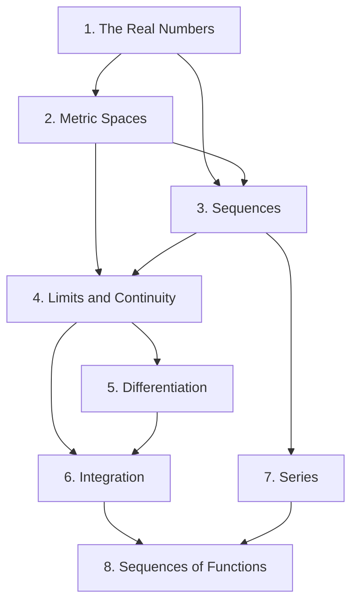

## Course information

| Item | Detail |
|---|---|
| Course | Introduction to Mathematical Analysis, 881.008 |
| Semester | Spring 2023 |
| Instructor | Ja A Jeong |
| Textbook | Manfred Stoll, *Introduction to Real Analysis*, 2nd edition |

The course covered Chapters 1 through 8, numbered as the lecture notes number
them — the notes use Roman numerals, I through VIII, and these write-ups use
Arabic for readability. Chapter 1 omitted §1.6 on binary and ternary
expansions. Series of real numbers, which some orderings place with sequences,
is its own chapter here.

> **On sources.** The lecture notes for this course are skeletons: Chapters 1
> to 3 as a handwritten summary and Chapters 4 to 8 as a typed workbook, both
> giving definitions and theorem statements in full and leaving every proof as
> blank space to be filled in during lecture. These write-ups fill that space.
> Proofs are given where the argument teaches something and sketched or omitted
> where it is routine, and each chapter's references say plainly which parts
> came from the notes and which are mine.
{: .prompt-info }

## What this course is about

This is the course where calculus gets its foundations. Everything in it was
already used, informally, in first-year calculus: limits, continuity,
derivatives, integrals, infinite sums. The job here is to say what those words
mean and to prove the theorems that were previously asserted.

One idea runs through the whole year, and it is worth naming at the start.
**Completeness.** The rational numbers have every algebraic property you could
want — they are an ordered field, they are dense in themselves, between any two
of them lies another — and they are still full of holes. There is no rational
number whose square is 2. The real numbers are what you get by filling those
holes, and the single axiom that fills them is the least upper bound property:
*every nonempty set bounded above has a supremum.*

Nearly every theorem in the course is that axiom wearing a disguise. The
Archimedean property is completeness. The Bolzano–Weierstrass theorem is
completeness. The Heine–Borel theorem, the convergence of monotone bounded
sequences, the convergence of Cauchy sequences, the intermediate value theorem,
the existence of the Riemann integral of a continuous function — all of them
unwind, eventually, to the same fact about suprema.

The second idea is **generality through abstraction**. Having built $$\mathbb{R}$$,
the course does not stay there. It defines a metric space — a set with a notion
of distance obeying three rules — and redoes open sets, closed sets, limits,
continuity and compactness in that setting. The cost is a layer of abstraction;
the payoff is that every later theorem comes with its hypotheses visible. When
you find out that continuous images of compact sets are compact, you also find
out exactly what compactness was for.

## Map of the chapters

**[Chapter 1 — The Real Numbers](/posts/analysis-real-numbers/)**
Sets and functions, mathematical induction, the field and order axioms, the
least upper bound property and its consequences, and countability. Ends with
Cantor's proof that the reals are uncountable.

**[Chapter 2 — Metric Spaces and the Structure of Point Sets](/posts/analysis-metric-spaces/)**
Metric spaces, open and closed sets, limit points and closure, connectedness,
compactness and the Heine–Borel theorem, and the Cantor set.

**[Chapter 3 — Sequences of Real Numbers](/posts/analysis-sequences/)**
Convergence in a metric space, the algebra of limits, monotone sequences,
subsequences and Bolzano–Weierstrass, limit superior and inferior, and Cauchy
sequences.

**[Chapter 4 — Limits and Continuity](/posts/analysis-continuity/)**
Limits of functions and the sequential criterion, continuity and its
topological characterization, continuity against compactness and
connectedness, uniform continuity, and the classification of discontinuities.

**[Chapter 5 — Differentiation](/posts/analysis-differentiation/)**
The derivative, the mean value theorems of Rolle and Lagrange and Cauchy, and
L'Hospital's rule.

**[Chapter 6 — Integration](/posts/analysis-integration/)**
The Darboux construction of the Riemann integral, its properties, the
fundamental theorem of calculus, improper integrals, and the
Riemann–Stieltjes integral.

**[Chapter 7 — Series of Real Numbers](/posts/analysis-series/)**
Convergence tests, the Dirichlet test, absolute versus conditional convergence
and the rearrangement theorem, and square summable sequences with the
Cauchy–Bunyakovsky–Schwarz and Minkowski inequalities.

**[Chapter 8 — Sequences and Series of Functions](/posts/analysis-function-sequences/)**
Pointwise convergence and the interchange of limits, uniform convergence, and
what uniform convergence buys you for continuity, integration and
differentiation.

## Notation conventions

Used consistently across all chapters of this course.

| Symbol | Meaning |
|---|---|
| $$\mathbb{N}, \mathbb{Z}, \mathbb{Q}, \mathbb{R}$$ | naturals (from 1), integers, rationals, reals |
| $$(X, d)$$ | a metric space: a set $$X$$ with a distance function $$d$$ |
| $$N_\varepsilon(p)$$ | the $$\varepsilon$$-neighbourhood $$\{x : d(p,x) < \varepsilon\}$$ |
| $$E^{\circ}$$, $$E'$$, $$\overline{E}$$ | interior, set of limit points, closure of $$E$$ |
| $$A \setminus B$$, $$A^{c}$$ | relative complement, complement |
| $$A \sim B$$ | $$A$$ and $$B$$ are equivalent, i.e. have the same cardinality |
| $$\sup E$$, $$\inf E$$ | supremum (least upper bound), infimum (greatest lower bound) |
| $$\{p_n\}$$ | a sequence, always infinite |
| $$\varepsilon, \delta$$ | arbitrary positive tolerances |
| $$\mathcal{P}(A)$$ | the power set of $$A$$ |

Three conventions worth flagging. First, $$\mathbb{N}$$ starts at $$1$$, not
$$0$$. Second, a **neighbourhood** always means an open ball; the notes write
$$N_\varepsilon(p)$$ where other books write $$B(p,\varepsilon)$$. Third, the
notes use the logical symbols $$\forall$$, $$\exists$$, $$\Leftrightarrow$$ and
`s.t.` heavily and compress definitions into single lines. These write-ups
expand them into English, because a definition you cannot read aloud is a
definition you do not yet know.

## Key takeaways

**Completeness is the axiom; everything else is a theorem.** If you remember one
thing, remember that the least upper bound property is the *only* thing
separating $$\mathbb{R}$$ from $$\mathbb{Q}$$, and that every existence theorem
in the course is drawing on it. When a proof produces a number out of nowhere,
look for the supremum.

**Definitions are the content.** In calculus the theorems were the material and
the definitions were preliminaries. Here it is reversed. The definition of a
limit, of compactness, of uniform continuity, of the integral — each took
mathematicians decades to get right, and each is doing precise work. Learn to
negate them; a definition you cannot negate is one you have memorized rather
than understood.

**Order of quantifiers is everything.** Continuity and uniform continuity differ
only in where $$\delta$$ is chosen relative to the point. Pointwise and uniform
convergence differ only in where $$N$$ is chosen relative to $$x$$. These are not
technicalities; they are the difference between a true theorem and a false one.

**Compactness is a finiteness property.** "Every open cover has a finite
subcover" looks like an arbitrary condition until you see what it does: it lets
you take a maximum over finitely many things instead of a supremum over
infinitely many. Every use of compactness in the course is that move.

**Counterexamples carry as much weight as proofs.** The function that is
continuous exactly at the irrationals, the sequence of continuous functions
converging pointwise to a discontinuous one, the conditionally convergent series
rearrangeable to any sum — each one marks the exact boundary of a theorem.
Collect them.

## Further resources

**Textbooks.** Rudin's *Principles of Mathematical Analysis* is the classic
companion at this level: terser than Stoll and with harder exercises, but
covering nearly the same ground in the same order. Abbott's *Understanding
Analysis* is the gentlest serious alternative and is unusually good at
explaining *why* each definition is shaped the way it is. Pugh's *Real
Mathematical Analysis* has the best pictures. For the point-set topology of
Chapter 2 on its own, Munkres' *Topology* Chapters 2 and 3 go further than this
course needs but make the definitions feel inevitable.

**On writing proofs.** This is likely the first course where the main skill
assessed is writing a correct proof rather than computing a correct answer.
Velleman's *How to Prove It* is the standard remedy if that transition is
rough.
