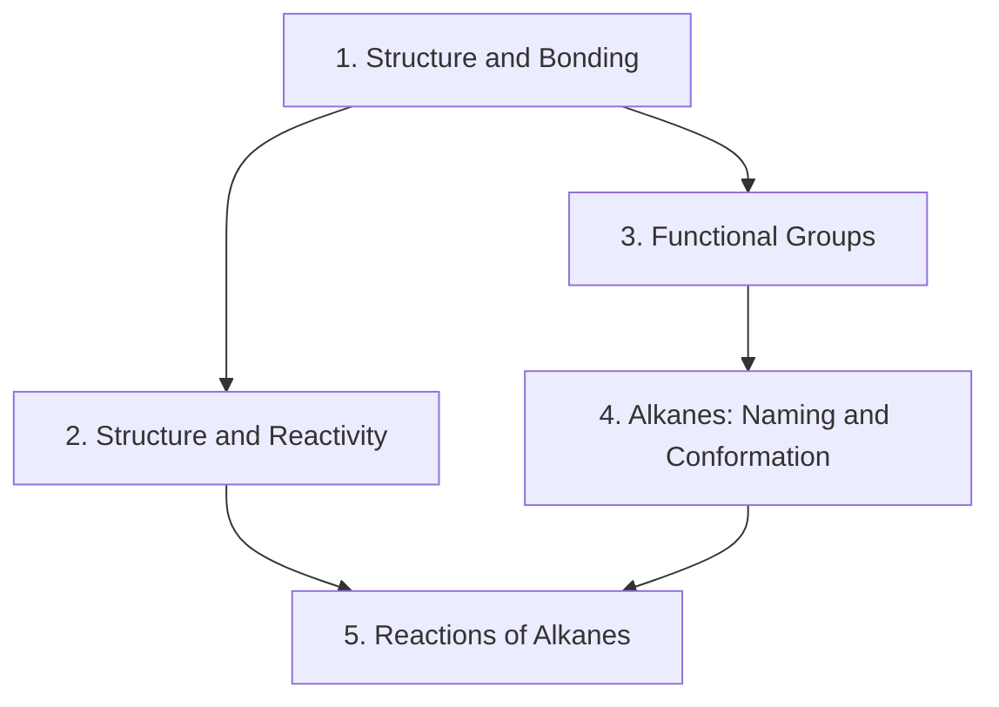

## Course information

| Item | Detail |
|---|---|
| Course | Organic Chemistry 1, 3343.205 |
| Institution | Seoul National University |
| Semester | Spring 2023 |
| Instructor | Seung Youn Hong (홍승윤), Department of Chemistry |
| Textbook | Peter C. Vollhardt & Neil E. Schore, *Organic Chemistry: Structure and Function*, 8th edition |

> **Scope of these write-ups.** I have lecture material for the first five
> sessions — orientation plus weeks 2 and 3 — and these notes cover exactly
> that: Vollhardt chapters 1 through 3, with a large block of acid–base theory
> that the course imports from elsewhere. The syllabus below lists the whole
> semester so the shape of the course is visible, but the units written up here
> stop at radical halogenation. Everything from cycloalkanes onwards is
> syllabus, not notes.
{: .prompt-info }

## What this course is about

The instructor opened the first lecture with a stated aim: **to obliterate the
notion that chemistry is a memorization course.** That is worth taking
seriously, because organic chemistry has a reputation — tens of thousands of
reactions, each with its own conditions — and the reputation is earned only if
you learn it the wrong way.

The right way is the one this course sets up in its first three chapters, and
it has three moves.

**First, structure determines reactivity.** Where the electrons are tells you
what a molecule will do. A carbon with a full octet and no polar bonds has
nothing to offer and nothing to accept; it is inert. Put an electronegative
atom next to it and you have created a partial positive charge, which is to say
a site that electron-rich things will attack. Almost all of the course is
elaborating that sentence.

**Second, every reaction is an equilibrium, and two separate questions decide
what you see in the flask.** *Will it go?* is thermodynamics — the sign and size
of ΔG°. *How fast?* is kinetics — the height of the barrier. These are
independent. Diamond converting to graphite is thermodynamically downhill and
kinetically never. Your desk is thermodynamically unstable with respect to
carbon dioxide and water, and the only reason it is still a desk is that the
barrier to combustion is high.

**Third, mechanism is a bookkeeping system for electrons.** The curved arrow is
not decoration. An arrow starts at a pair of electrons and ends where that pair
goes, and once you accept that constraint, most "new" reactions turn out to be
rearrangements of a dozen elementary steps you have already seen.

The three chapters covered here supply, in order, the structural vocabulary
(chapter 1), the energetic and acid–base framework (chapter 2), and the first
real reaction mechanism (chapter 3). Radical halogenation is chosen first not
because it is the most useful reaction — it is not — but because it is the
simplest complete mechanism: initiation, propagation, termination, with every
step's enthalpy computable from a table of bond strengths.

## Map of the units

**[Unit 1 — Structure and Bonding](/posts/organic-chemistry-1-structure-bonding/)**
Why organic chemistry exists as a separate subject, Wöhler and the death of
vitalism, ionic and covalent bonding, electronegativity and polarity, Lewis
structures and formal charge, resonance and how to rank contributors, atomic
orbitals, molecular orbital theory by LCAO, and hybridization through to the
double and triple bonds of ethene and ethyne.

**[Unit 2 — Structure and Reactivity](/posts/organic-chemistry-1-structure-reactivity/)**
Equilibria and Gibbs free energy, enthalpy from bond strengths, entropy,
activation barriers and the Boltzmann distribution, rate laws and the Arrhenius
equation, potential energy diagrams and the rate-determining step. Then
Brønsted–Lowry acids and bases, curved-arrow notation, pKa, the four factors
that determine acid strength, nitrogen bases, and the Lewis picture that
renames the whole thing electrophile and nucleophile.

**[Unit 3 — Functional Groups and Physical Properties](/posts/organic-chemistry-1-functional-groups/)**
What a functional group is and why it localizes reactivity, the three
intermolecular forces, and how they determine boiling point, melting point and
solubility. Ends with why milk works on chilli and water does not.

**[Unit 4 — Alkanes: Nomenclature and Conformation](/posts/organic-chemistry-1-alkanes/)**
Constitutional isomers and homologous series, the IUPAC naming rules worked
through on a deliberately horrible example, then conformational analysis:
Newman projections, staggered and eclipsed ethane, anti and gauche butane, and
the separation of torsional strain from steric strain.

**[Unit 5 — Reactions of Alkanes: Radical Halogenation](/posts/organic-chemistry-1-radical-halogenation/)**
Homolytic versus heterolytic cleavage, bond dissociation energies, the
structure and stability of alkyl radicals, hyperconjugation, the full chain
mechanism for methane and chlorine, why fluorine explodes and iodine does
nothing, the Hammond postulate, and why bromine is selective where chlorine is
not.

## Syllabus

The course ran Tuesdays and Thursdays, 09:30–10:45, in Building 28 Room 301,
with General Chemistry I and II as prerequisites. The semester plan, by week:

- **Week 1** — orientation
- **Week 2** — chapters 1 and 2: structure, bonding, and reactivity
- **Week 3** — chapter 3: reactions of alkanes
- **Week 4** — chapter 4: cycloalkanes
- **Week 5** — chapter 5: stereoisomers
- **Week 6** — chapter 6: nucleophilic substitution
- **Week 7** — chapter 7: elimination
- **Week 8** — midterm
- **Week 9** — chapter 8: alcohols
- **Week 10** — chapter 9: reactions of alcohols and ethers
- **Week 11** — chapter 10: nuclear magnetic resonance
- **Week 12** — chapter 11: infrared spectroscopy and mass spectrometry
- **Week 13** — chapter 12: reactions of alkenes
- **Week 14** — chapter 13: alkynes

Assessment was on an absolute scale — A+ at 95 and above, down to D below 50,
with an automatic F for missing more than a third of classes. The weighting:

| Component | Weight |
|---|---|
| Attendance | 5% |
| Problem sets (4 × 5%) | 20% |
| Midterm | 35% |
| Final | 40% |

Problem sets were due 23 March, 13 April, 18 May and 1 June. The midterm ran
18 April, 09:30–12:30; the final, 13 June.

## Notation conventions

Used consistently across all units of this course.

| Symbol | Meaning |
|---|---|
| ΔH°, ΔS°, ΔG° | standard enthalpy, entropy and free energy change |
| DH° | bond dissociation energy — always positive, always homolytic |
| Ea | activation energy, the barrier height |
| K | equilibrium constant; Ka the acidity constant, pKa = −log Ka |
| pKaH | the pKa of a base's *conjugate acid*, used to rank base strength |
| R, R′ | an unspecified alkyl group; R–H is the corresponding alkane |
| X | a halogen: F, Cl, Br or I |
| 1°, 2°, 3° | primary, secondary, tertiary |
| δ+, δ− | partial charges from bond polarity |
| ⇌ | an equilibrium; → a reaction written in one direction |
| ‡ | a transition state |

Two drawing conventions matter more than they look.

**Curved arrows.** A double-barbed arrow moves a *pair* of electrons; a
single-barbed "fishhook" arrow moves *one* electron. The tail sits on the
electrons being moved — a lone pair or the middle of a bond — and the head
points at the atom or bond position where they end up. Radical mechanisms use
fishhooks exclusively; polar mechanisms use double-barbed arrows exclusively.
Mixing them in one step is almost always a sign the step is wrong.

**Hashed-wedged lines.** A plain line lies in the plane of the page, a solid
wedge comes towards the reader, and a hashed wedge goes away. This is the only
way to show three-dimensional geometry on paper, and from chapter 4 onwards the
whole subject depends on it.

Energies throughout are in **kcal mol⁻¹**, which is what Vollhardt uses; the
kJ mol⁻¹ equivalent is given where the slides gave both. The conversion is
1 kcal = 4.184 kJ.

## Key takeaways

**Electronegativity is the master variable of chapters 1 and 2.** It decides
bond polarity, which decides where a molecule is attacked. It decides acidity
across a row of the periodic table. It drives inductive effects. When a
question asks "why is this one more acidic / more reactive / more polar", the
first thing to check is always which atom is pulling electron density.

**Down a column, size beats electronegativity.** This is the one place where the
obvious answer is wrong, and it is wrong for a good reason: a charge spread over
a larger volume is a more stable charge. HI is a stronger acid than HF even
though fluorine is far more electronegative, because iodide is enormous.

**To compare two acids, draw the conjugate bases.** Acid strength is never
really about the acid; it is about how comfortable the anion left behind is.
Four things make an anion comfortable — the element it sits on, inductive
withdrawal through σ bonds, delocalization by resonance, and the s-character of
the orbital holding the lone pair — and in a contest between them, element
effects usually win.

**Thermodynamics and kinetics answer different questions.** ΔG° tells you where
the equilibrium sits. Ea tells you how long you will wait. A reaction can be
wildly exothermic and still not happen at room temperature, and the entire
practice of synthetic chemistry lives in that gap.

**The Hammond postulate is how you convert stability into rate.** Transition
states are not observable, so you estimate them by their nearest observable
neighbour: in an exothermic step the transition state looks like the reactants,
in an endothermic step it looks like the products. That single idea explains why
bromination is selective and chlorination is not, and it will come back in every
later chapter.

**Conformations are not isomers.** Rotation about a single bond costs a few
kcal mol⁻¹ and happens millions of times a second at room temperature. Nothing
you can isolate differs by a conformation — but the *population* of
conformations controls reaction rates, and from cyclohexane onwards that becomes
the central fact of the subject.

## Further resources

**Textbooks.** The course text is Vollhardt & Schore, 8th edition, and it is the
right one to follow for the mechanistic emphasis. The lectures also borrowed
heavily from **Janice Smith's** *Organic Chemistry* — the four-factor treatment
of acid strength in unit 2 and the intermolecular-forces material in unit 3 are
Smith's organization rather than Vollhardt's, and the slide artwork makes that
obvious. The instructor listed **Klein**'s *Organic Chemistry* (4th edition) and
**McMurry**'s (8th edition) as supplementary; Klein is the gentlest of the four
and has by far the best problem sets for drilling mechanism.

**On arrow pushing.** If one skill is worth separate practice, it is this.
Scudder's *Electron Flow in Organic Chemistry* and the arrow-pushing chapters of
Klein's *Organic Chemistry as a Second Language* both do nothing else, and both
are short.

**Tables worth bookmarking.** Vollhardt's Table 2.2 (pKa values), the chapter 3
bond-dissociation-energy tables, Table 3.5 (propagation enthalpies) and
Table 4.3 (strain energies) are referenced constantly in units 2, 4 and 5. Learning a
handful of anchor values — water at 15.7, acetic acid at 4.7, a C–H bond at
roughly 100 kcal mol⁻¹ — is more useful than memorizing any of the tables.
